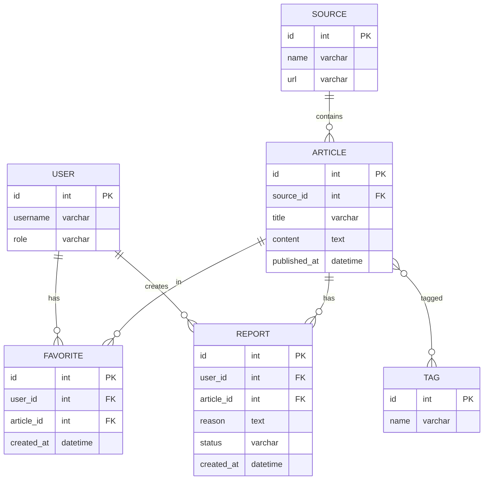

# Вариант 37 — Ключевые сущности, связи и API (эскиз)

Сущности (основные)

- User
  - id: UUID
  - username: string (unique)
  - password_hash: string
  - role: enum [admin, moderator, user]

- Source
  - id: UUID
  - name: string
  - url: string
  - description: string

- Article
  - id: UUID
  - source_id: reference -> Source.id
  - title: string
  - content: text
  - published_at: datetime
  - url: string

- Tag
  - id: UUID
  - name: string (unique)

- ArticleTag (связующая таблица)
  - article_id: reference -> Article.id
  - tag_id: reference -> Tag.id

- Favorite
  - id: UUID
  - user_id: reference -> User.id
  - article_id: reference -> Article.id
  - created_at: datetime

- Report
  - id: UUID
  - user_id: reference -> User.id
  - article_id: reference -> Article.id
  - reason: string
  - status: enum [new, reviewed, closed]
  - created_at: datetime

Связи (ER-эскиз)

- Source 1..* Article (источник содержит статьи)
- Article *..* Tag (статья имеет теги)
- User 1..* Favorite (пользователь имеет избранное)
- User 1..* Report (пользователь подаёт жалобы)
- Article 1..* Report (на статью могут быть жалобы)

Обязательные поля и ограничения (кратко)

- unique(User.username)
- unique(Tag.name)
- Article.source_id → Source.id (FK, not null)
- Favorite.user_id → User.id (FK, not null)
- Favorite.article_id → Article.id (FK, not null)
- Report.user_id → User.id (FK, not null)
- Report.article_id → Article.id (FK, not null)

API — верхнеуровневые ресурсы и операции

- /users
  - GET /users (admin)
  - POST /users (admin)
  - GET /users/{id}
  - PUT /users/{id}
  - DELETE /users/{id}

- /sources
  - GET /sources (list)
  - POST /sources (admin)
  - GET /sources/{id}
  - PUT /sources/{id} (admin)
  - DELETE /sources/{id} (admin)

- /feed
  - GET /feed (list articles, filter by tag/source)
  - GET /feed/{id} (article details)

- /tags
  - GET /tags (list)
  - POST /tags (admin)
  - GET /tags/{id}
  - PUT /tags/{id} (admin)
  - DELETE /tags/{id} (admin)

- /favorites
  - GET /favorites (user's favorites)
  - POST /favorites (add to favorites)
  - DELETE /favorites/{id} (remove from favorites)

- /reports
  - GET /reports (admin/moderator)
  - POST /reports (user creates report)
  - GET /reports/{id}
  - PUT /reports/{id} (moderator/admin - change status)

---

## Подробные операции API, схемы и поведение

Общие принципы

- Ответы в формате: `{ "status": "ok" | "error", "data"?: ..., "error"?: {code, message, fields?} }`
- Пагинация: `limit` и `offset` (по умолчанию limit=50).
- Аутентификация: `Authorization: Bearer <jwt>`; роли: `admin`, `moderator`, `user`.

Примеры ошибок (JSON)

```json
{
  "status": "error",
  "error": { "code": "validation_failed", "message": "Validation failed", "fields": { "name": "required" } }
}
```

Auth

- POST `/auth/register` — `{username, password}` → `201 {id, username, role}`
- POST `/auth/login` — `{username, password}` → `200 {accessToken, refreshToken, user}`
- POST `/auth/refresh` — `{refreshToken}` → `200 {accessToken}`

Users

- GET `/users?limit=&offset=` — Admin
- GET `/users/{id}` — Admin или self
- POST `/users` — Admin (payload: `{username,email,password,role?}`)
- PUT `/users/{id}` — Admin или self (частичное обновление)
- DELETE `/users/{id}` — Admin

Sources

- GET `/sources?limit=&offset=` — список источников
- POST `/sources` — Admin (payload: `{name,url,description?}`)
- GET `/sources/{id}` — детали источника
- PUT `/sources/{id}` — Admin
- DELETE `/sources/{id}` — Admin

Feed (Articles)

- GET `/feed?tagId=&sourceId=&limit=&offset=` — список статей с фильтрами
- GET `/feed/{id}` — детали статьи

Tags

- GET `/tags?limit=&offset=` — список тегов
- POST `/tags` — Admin `{name}` → `201 {id}`
- GET `/tags/{id}` — детали тега
- PUT `/tags/{id}` — Admin
- DELETE `/tags/{id}` — Admin

Favorites

- GET `/favorites?limit=&offset=` — список избранного текущего пользователя
- POST `/favorites` — `{articleId}` → `201 {id}`
- DELETE `/favorites/{id}` — удалить из избранного

Reports (жалобы)

- GET `/reports?status=&limit=&offset=` — Admin/Moderator
- POST `/reports` — User `{articleId, reason}` → `201 {id}`
- GET `/reports/{id}` — детали жалобы
- PUT `/reports/{id}` — Moderator/Admin (изменить статус: reviewed, closed)

---

## ERD (диаграмма сущностей)

Mermaid-диаграмма (если рендер поддерживается):



ASCII-эскиз (если mermaid не рендерится):

```text
Source 1---* Article *---* Tag
                |
User 1---* Favorite *---1 Article
     \
      \-*- Report ---*---1 Article
```

---

AC — критерии приёмки для функционала Reports (MVP)

- AC1: При создании Report через POST `/reports`, создаётся запись со статусом `new`.
- AC2: GET `/reports` возвращает жалобы только для Admin/Moderator.
- AC3: PUT `/reports/{id}` позволяет изменить статус на `reviewed` или `closed`.
