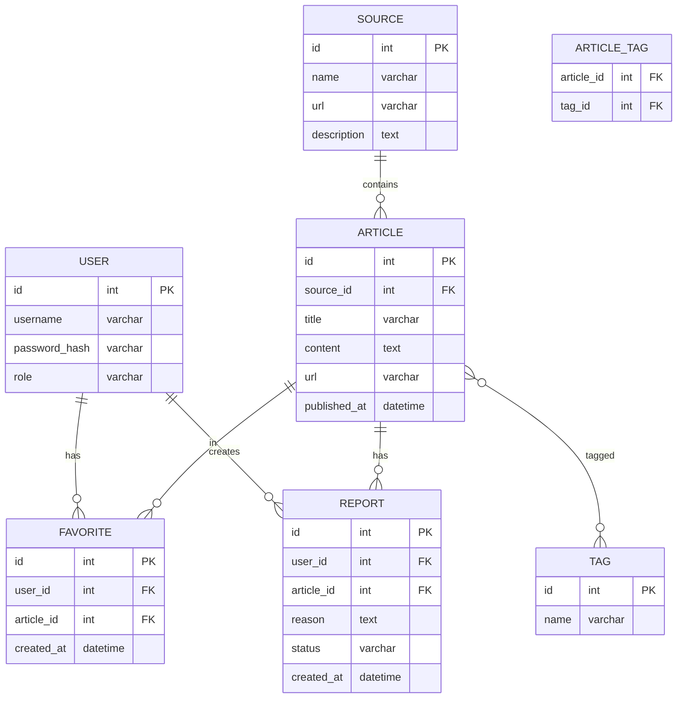

# Вариант 37 — ERD (диаграмма сущностей) — Новости «Без фейков»

Файл содержит: 1) mermaid-диаграмму ERD; 2) ASCII-эскиз; 3) минимальный SQL DDL-скетч для создания таблиц.

## Mermaid ERD



## ASCII-эскиз

```
Source 1---* Article *---* Tag
                |
User 1---* Favorite ---* Article
     \
      \---* Report ---* Article
```

## Минимальный SQL DDL (пример, PostgreSQL)

```sql
CREATE TABLE users (
 id UUID PRIMARY KEY,
 username TEXT UNIQUE NOT NULL,
 password_hash TEXT NOT NULL,
 role TEXT NOT NULL CHECK (role IN ('admin','moderator','user'))
);

CREATE TABLE sources (
 id UUID PRIMARY KEY,
 name TEXT NOT NULL,
 url TEXT NOT NULL,
 description TEXT
);

CREATE TABLE articles (
 id UUID PRIMARY KEY,
 source_id UUID NOT NULL REFERENCES sources(id) ON DELETE CASCADE,
 title TEXT NOT NULL,
 content TEXT,
 url TEXT,
 published_at TIMESTAMP WITH TIME ZONE
);

CREATE TABLE tags (
 id UUID PRIMARY KEY,
 name TEXT UNIQUE NOT NULL
);

CREATE TABLE article_tags (
 article_id UUID NOT NULL REFERENCES articles(id) ON DELETE CASCADE,
 tag_id UUID NOT NULL REFERENCES tags(id) ON DELETE CASCADE,
 PRIMARY KEY (article_id, tag_id)
);

CREATE TABLE favorites (
 id UUID PRIMARY KEY,
 user_id UUID NOT NULL REFERENCES users(id) ON DELETE CASCADE,
 article_id UUID NOT NULL REFERENCES articles(id) ON DELETE CASCADE,
 created_at TIMESTAMP WITH TIME ZONE DEFAULT now(),
 UNIQUE (user_id, article_id)
);

CREATE TABLE reports (
 id UUID PRIMARY KEY,
 user_id UUID NOT NULL REFERENCES users(id),
 article_id UUID NOT NULL REFERENCES articles(id),
 reason TEXT NOT NULL,
 status TEXT NOT NULL CHECK (status IN ('new','reviewed','closed')),
 created_at TIMESTAMP WITH TIME ZONE DEFAULT now()
);
```
