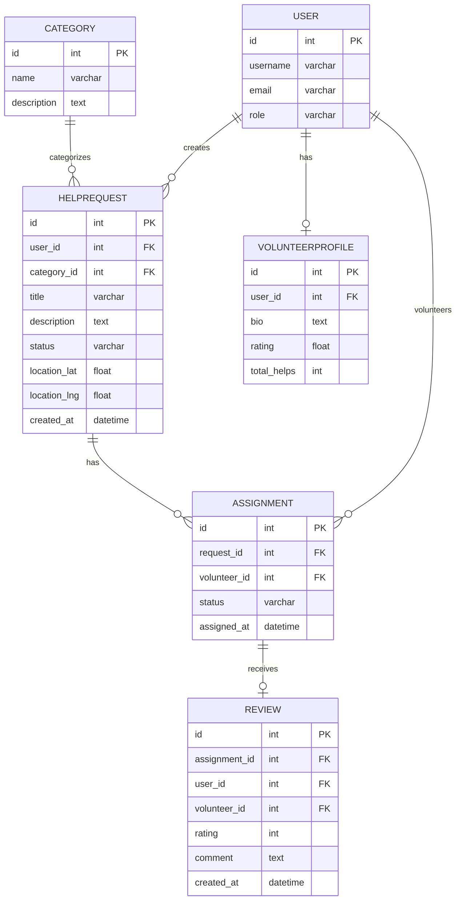

# Вариант 43 — Ключевые сущности, связи и API (эскиз)

Сущности (основные)

- User
  - id: UUID
  - username: string (unique)
  - password_hash: string
  - role: enum [admin, user] — только 2 роли; волонтёр = user с VolunteerProfile
  - email: string

- Category
  - id: UUID
  - name: string
  - description: string
  - icon: string (optional)

- HelpRequest
  - id: UUID
  - user_id: reference -> User.id
  - category_id: reference -> Category.id
  - title: string
  - description: string
  - status: enum [new, assigned, in_progress, completed, cancelled]
  - location_lat: number
  - location_lng: number
  - location_address: string
  - created_at: datetime
  - updated_at: datetime

- VolunteerProfile
  - id: UUID
  - user_id: reference -> User.id (unique, 1:1)
  - bio: string
  - rating: number (avg, calculated)
  - total_helps: number (calculated)
  - location_lat: number (optional)
  - location_lng: number (optional)

- Assignment
  - id: UUID
  - request_id: reference -> HelpRequest.id
  - volunteer_id: reference -> User.id
  - status: enum [assigned, in_progress, completed, cancelled]
  - assigned_at: datetime
  - completed_at: datetime (optional)

- Review
  - id: UUID
  - assignment_id: reference -> Assignment.id
  - user_id: reference -> User.id
  - volunteer_id: reference -> User.id
  - rating: number (1-5)
  - comment: string
  - created_at: datetime

- Location (optional, embedded)
  - latitude: number
  - longitude: number
  - address: string

Связи (ER-эскиз)

- User 1..* HelpRequest (пользователь создаёт запросы)
- User 1..1 VolunteerProfile (волонтёр имеет профиль)
- Category 1..* HelpRequest (категория относится к запросам)
- HelpRequest 1..* Assignment (запрос может иметь назначения)
- Assignment 1..1 Review (завершённое назначение может иметь отзыв)

Обязательные поля и ограничения (кратко)

- unique(User.username)
- unique(User.email)
- HelpRequest.user_id → User.id (FK, not null)
- HelpRequest.category_id → Category.id (FK, not null)
- Assignment.request_id → HelpRequest.id (FK, not null)
- Assignment.volunteer_id → User.id (FK, not null)
- Review.assignment_id → Assignment.id (FK, not null)

API — верхнеуровневые ресурсы и операции

- /users
  - GET /users (admin)
  - POST /users (admin)
  - GET /users/{id}
  - PUT /users/{id}
  - DELETE /users/{id}

- /categories
  - GET /categories (list all)
  - POST /categories (admin)
  - GET /categories/{id}
  - PUT /categories/{id} (admin)
  - DELETE /categories/{id} (admin)

- /requests
  - GET /requests (list, filter by status, category, location; волонтёры видят все new, users — только свои)
  - POST /requests (user)
  - GET /requests/{id}
  - PUT /requests/{id} (owner или admin)
  - DELETE /requests/{id} (owner при status=new, или admin)

- /volunteers
  - GET /volunteers (list, filter by rating)
  - POST /volunteers (user создаёт себе профиль, admin может создать любому)
  - GET /volunteers/{id}
  - PUT /volunteers/{id} (self или admin)
  - DELETE /volunteers/{id} (self или admin)

- /assignments
  - GET /assignments (filter by request, volunteer, status)
  - POST /assignments (volunteer or admin)
  - GET /assignments/{id}
  - PUT /assignments/{id} (volunteer or admin)
  - DELETE /assignments/{id} (admin)

- /reviews
  - GET /reviews (filter by volunteer)
  - POST /reviews (user)
  - GET /reviews/{id}
  - PUT /reviews/{id} (owner or admin)
  - DELETE /reviews/{id} (admin)

Дополнительно (бонусы)

- Карта с запросами и волонтёрами (UI)
- Приоритеты для запросов помощи
- Авто-подбор волонтёра по локации (заглушка)
- Документация API (OpenAPI/Swagger)
- Тесты: unit + интеграционные
- Kubernetes deployment
- CI/CD pipeline

---

## Подробные операции API, схемы и поведение

Общие принципы

- Ответы в формате: `{ "status": "ok" | "error", "data"?: ..., "error"?: {code, message, fields?} }`
- Пагинация: `limit` и `offset` (по умолчанию limit=50).
- Аутентификация: `Authorization: Bearer <jwt>`; роли: `admin`, `user` (волонтёр = user с VolunteerProfile).

Примеры ошибок (JSON)

```json
{
  "status": "error",
  "error": { "code": "validation_failed", "message": "Validation failed", "fields": { "title": "required" } }
}
```

Auth

- POST `/auth/register` — `{email, password, username, role?}` → `201 {id, email, username, role}`
- POST `/auth/login` — `{email, password}` → `200 {accessToken, refreshToken, user}`
- POST `/auth/refresh` — `{refreshToken}` → `200 {accessToken}`

Users

- GET `/users?limit=&offset=` — Admin
- GET `/users/{id}` — Admin или self
- POST `/users` — Admin (payload: `{username,email,password,role?}`)
- PUT `/users/{id}` — Admin или self (частичное обновление)
- DELETE `/users/{id}` — Admin

Categories

- GET `/categories?limit=&offset=` — список категорий
- POST `/categories` — Admin (payload: `{name,description,icon?}`)
- GET `/categories/{id}` — детали категории
- PUT `/categories/{id}` — Admin
- DELETE `/categories/{id}` — Admin

HelpRequests

- GET `/requests?status=&categoryId=&userId=&lat=&lng=&radius=&limit=&offset=` — список запросов
  - User без VolunteerProfile: только свои запросы
  - User с VolunteerProfile: свои + все со status=new
  - Admin: все запросы
- POST `/requests` — User (payload: `{title,description,categoryId,location:{lat,lng,address}}`)
- GET `/requests/{id}` — детали запроса (проверка доступа)
- PUT `/requests/{id}` — User (owner) или Admin
- DELETE `/requests/{id}` — User (owner, **только если status=new**) или Admin

Volunteers (профили)

- GET `/volunteers?rating=&limit=&offset=` — список волонтёров
- POST `/volunteers` — User (создаёт себе) или Admin (любому): `{userId?, bio}` → `201 {id}`
  - Если userId не указан, берётся currentUser.id
  - Проверка: у user ещё нет VolunteerProfile
- GET `/volunteers/{id}` — детали профиля
- PUT `/volunteers/{id}` — self или Admin
- DELETE `/volunteers/{id}` — self или Admin

Assignments

- POST `/assignments` — User с VolunteerProfile или Admin
  - Payload: `{requestId, volunteerId?}` (если volunteerId не указан, берётся currentUser.id)
  - **Проверки безопасности:**
    - User должен иметь VolunteerProfile
    - Request.status должен быть 'new'
    - Нет активного Assignment на этот request
  - Response: `201 {id, requestId, volunteerId, status, assignedAt}`
  - Side effect: Request.status → 'assigned'

- GET `/assignments?requestId=&volunteerId=&status=&limit=&offset=` — список назначений
- GET `/assignments/{id}` — детали назначения
- PUT `/assignments/{id}` — Volunteer (свой) или Admin
  - Payload: `{status}` — изменить статус (in_progress, completed, cancelled)
  - **Проверка:** assignment.volunteer_id === currentUser.id или role=admin
- DELETE `/assignments/{id}` — Admin

Reviews

- POST `/reviews` — User (после completed Assignment)
  - Payload: `{assignmentId, rating, comment}`
  - **Проверки безопасности:**
    - Assignment.status === 'completed'
    - Assignment.request.user_id === currentUser.id (отзыв оставляет автор запроса)
    - Отзыв на этот Assignment ещё не существует
  - Response: `201 {id, assignmentId, rating, comment, createdAt}`
  - Side effect: пересчёт rating и total_helps у VolunteerProfile

- GET `/reviews?volunteerId=&limit=&offset=` — список отзывов
- GET `/reviews/{id}` — детали отзыва
- PUT `/reviews/{id}` — User (owner) или Admin
- DELETE `/reviews/{id}` — Admin

Чат (UI-заглушка, без таблицы в БД)

- GET `/chats/{assignmentId}/messages` — заглушка, возвращает `{data: [], message: "Chat coming soon"}`
- POST `/chats/{assignmentId}/messages` — заглушка, возвращает `{status: "ok", message: "Chat coming soon"}`

**Примечание:** Таблица messages не создаётся в MVP. Эндпоинты существуют только для демонстрации UI.

Статистика и отчёты

- GET `/volunteers/{id}/stats` — статистика волонтёра (total_helps, avg_rating, reviews_count)
- GET `/dashboards/admin/stats` — общая статистика (total_requests, total_volunteers, active_assignments)

---

## ERD (диаграмма сущностей)

Mermaid-диаграмма (если рендер поддерживается):



ASCII-эскиз (если mermaid не рендерится):

```text
User 1---* HelpRequest 1---* Assignment *---1 User (Volunteer)
     \                                              /
      \-1- VolunteerProfile                       /
                                                 /
                            Assignment 1---0..1 Review
                                /
Category 1---* HelpRequest
```

---

AC — критерии приёмки для функционала (MVP)

- AC1: POST `/requests` создаёт запрос помощи со статусом `new` и привязкой к категории и локации.
- AC2: GET `/requests?status=new` возвращает список активных запросов, доступных для откликов.
- AC3: POST `/assignments` назначает волонтёра на запрос, изменяет статус запроса на `assigned`.
- AC4: PUT `/assignments/{id}` изменяет статус назначения на `completed` и открывает возможность для отзыва.
- AC5: POST `/reviews` создаёт отзыв с оценкой, обновляет средний рейтинг волонтёра.
