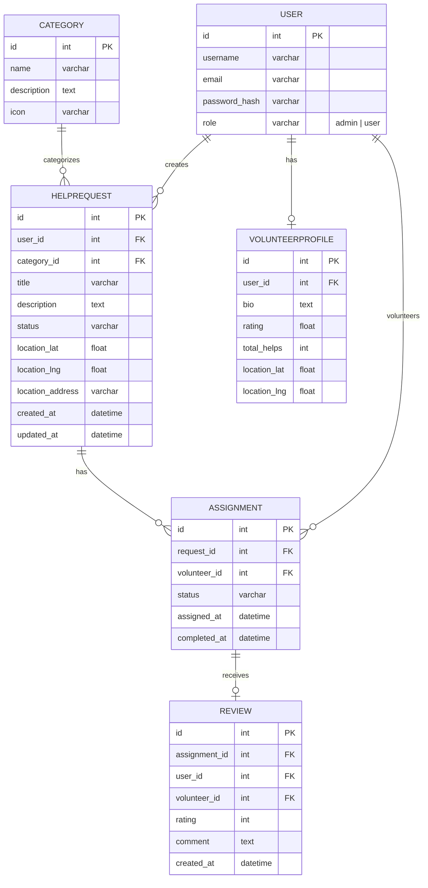

# Вариант 43 — ERD (диаграмма сущностей) — Волонтёры «Помощь рядом»

Файл содержит: 1) mermaid-диаграмму ERD; 2) ASCII-эскиз; 3) минимальный SQL DDL-скетч для создания таблиц.

## Mermaid ERD



## ASCII-эскиз

```
User 1---* HelpRequest 1---* Assignment *---1 User (Volunteer)
     \                                              /
      \-1- VolunteerProfile                       /
                                                 /
                            Assignment 1---0..1 Review
                                /
Category 1---* HelpRequest
```

## Минимальный SQL DDL (пример, PostgreSQL)

```sql
CREATE TABLE users (
 id UUID PRIMARY KEY,
 username TEXT UNIQUE NOT NULL,
 email TEXT UNIQUE NOT NULL,
 password_hash TEXT NOT NULL,
 role TEXT NOT NULL CHECK (role IN ('admin','user'))
);

CREATE TABLE categories (
 id UUID PRIMARY KEY,
 name TEXT NOT NULL,
 description TEXT,
 icon TEXT
);

CREATE TABLE help_requests (
 id UUID PRIMARY KEY,
 user_id UUID NOT NULL REFERENCES users(id) ON DELETE CASCADE,
 category_id UUID NOT NULL REFERENCES categories(id),
 title TEXT NOT NULL,
 description TEXT NOT NULL,
 status TEXT NOT NULL CHECK (status IN ('new','assigned','in_progress','completed','cancelled')),
 location_lat DOUBLE PRECISION,
 location_lng DOUBLE PRECISION,
 location_address TEXT,
 created_at TIMESTAMP WITH TIME ZONE DEFAULT now(),
 updated_at TIMESTAMP WITH TIME ZONE DEFAULT now()
);

CREATE TABLE volunteer_profiles (
 id UUID PRIMARY KEY,
 user_id UUID NOT NULL REFERENCES users(id) ON DELETE CASCADE UNIQUE,
 bio TEXT,
 rating DOUBLE PRECISION DEFAULT 0,
 total_helps INTEGER DEFAULT 0,
 location_lat DOUBLE PRECISION,
 location_lng DOUBLE PRECISION
);

CREATE TABLE assignments (
 id UUID PRIMARY KEY,
 request_id UUID NOT NULL REFERENCES help_requests(id) ON DELETE CASCADE,
 volunteer_id UUID NOT NULL REFERENCES users(id),
 status TEXT NOT NULL CHECK (status IN ('assigned','in_progress','completed','cancelled')),
 assigned_at TIMESTAMP WITH TIME ZONE DEFAULT now(),
 completed_at TIMESTAMP WITH TIME ZONE
);

CREATE TABLE reviews (
 id UUID PRIMARY KEY,
 assignment_id UUID NOT NULL REFERENCES assignments(id) ON DELETE CASCADE,
 user_id UUID NOT NULL REFERENCES users(id),
 volunteer_id UUID NOT NULL REFERENCES users(id),
 rating INTEGER NOT NULL CHECK (rating >= 1 AND rating <= 5),
 comment TEXT,
 created_at TIMESTAMP WITH TIME ZONE DEFAULT now()
);
```
