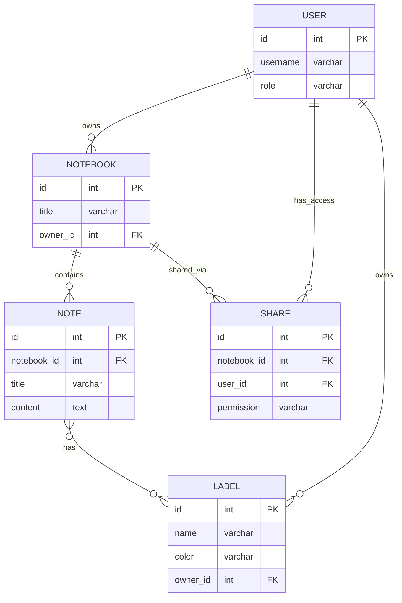

# Вариант 16 — Ключевые сущности, связи и API (эскиз)

Сущности (основные)

- User
  - id: UUID
  - username: string (unique)
  - password_hash: string
  - role: enum [admin, user]

- Notebook
  - id: UUID
  - title: string
  - description: string
  - owner_id: reference -> User.id
  - created_at: datetime
  - updated_at: datetime

- Note
  - id: UUID
  - notebook_id: reference -> Notebook.id
  - title: string
  - content: text
  - created_at: datetime
  - updated_at: datetime

- Label
  - id: UUID
  - name: string
  - color: string
  - owner_id: reference -> User.id

- NoteLabel (связь Note и Label)
  - note_id: reference -> Note.id
  - label_id: reference -> Label.id

- Share
  - id: UUID
  - notebook_id: reference -> Notebook.id
  - user_id: reference -> User.id
  - permission: enum [read, write]
  - created_at: datetime

Связи (ER-эскиз)

- User 1..* Notebook (пользователь владеет тетрадями)
- Notebook 1..* Note (тетрадь содержит заметки)
- Note *..* Label (заметка может иметь метки)
- Notebook 1..* Share (тетрадь может быть расшарена)
- User 1..* Share (пользователю предоставлен доступ)

Обязательные поля и ограничения (кратко)

- unique(User.username)
- Notebook.owner_id → User.id (FK, not null)
- Note.notebook_id → Notebook.id (FK, not null)
- Label.owner_id → User.id (FK, not null)
- Share.notebook_id → Notebook.id (FK, not null)
- Share.user_id → User.id (FK, not null)

API — верхнеуровневые ресурсы и операции

- /users
  - GET /users (admin)
  - POST /users (admin)
  - GET /users/{id}
  - PUT /users/{id}
  - DELETE /users/{id}

- /notebooks
  - GET /notebooks (list, filter by owner or shared)
  - POST /notebooks
  - GET /notebooks/{id}
  - PUT /notebooks/{id}
  - DELETE /notebooks/{id}

- /notes
  - GET /notes (filter by notebook)
  - POST /notes
  - GET /notes/{id}
  - PUT /notes/{id}
  - DELETE /notes/{id}

- /labels
  - GET /labels (filter by owner)
  - POST /labels
  - GET /labels/{id}
  - PUT /labels/{id}
  - DELETE /labels/{id}

- /shares
  - GET /shares (filter by notebook)
  - POST /shares
  - DELETE /shares/{id}

Дополнительно (бонусы)

- WebSocket /ws/notes — совместное редактирование в реальном времени
- Офлайн-кэш для работы без интернета
- Документация API (OpenAPI/Swagger)
- Тесты: unit + интеграционные

---

## Подробные операции API, схемы и поведение

Общие принципы

- Ответы в формате: `{ "status": "ok" | "error", "data"?: ..., "error"?: {code, message, fields?} }`
- Пагинация: `limit` и `offset` (по умолчанию limit=50).
- Аутентификация: `Authorization: Bearer <jwt>`; роли: `admin`, `user`.

Примеры ошибок (JSON)

```json
{
  "status": "error",
  "error": { "code": "validation_failed", "message": "Validation failed", "fields": { "title": "required" } }
}
```

Auth

- POST `/auth/register` — `{username, password}` → `201 {id, username, role}`
- POST `/auth/login` — `{username, password}` → `200 {accessToken, refreshToken, user}`
- POST `/auth/refresh` — `{refreshToken}` → `200 {accessToken}`

Users

- GET `/users?limit=&offset=` — Admin
- GET `/users/{id}` — Admin или self
- POST `/users` — Admin (payload: `{username,password,role?}`)
- PUT `/users/{id}` — Admin или self (частичное обновление)
- DELETE `/users/{id}` — Admin

Notebooks

- GET `/notebooks?ownerId=&shared=&limit=&offset=` — список
- POST `/notebooks` — (payload: `{title,description?}`)
- GET `/notebooks/{id}` — детали, включает список заметок
- PUT `/notebooks/{id}` — владелец или admin
- DELETE `/notebooks/{id}` — владелец или admin

Notes

- GET `/notes?notebookId=&labelId=&limit=&offset=` — список заметок
- POST `/notes` — `{notebookId, title, content?}` → `201 {id}`
- GET `/notes/{id}` — детали заметки с историей
- PUT `/notes/{id}` — владелец или при наличии write доступа
- DELETE `/notes/{id}` — владелец или admin

Labels

- GET `/labels?ownerId=&limit=&offset=` — список меток
- POST `/labels` — `{name, color?}` → `201 {id}`
- GET `/labels/{id}` — детали метки
- PUT `/labels/{id}` — владелец или admin
- DELETE `/labels/{id}` — владелец или admin

Shares

- GET `/shares?notebookId=&userId=&limit=&offset=` — список доступов
- POST `/shares` — `{notebookId, userId, permission}` → `201 {id}`
- DELETE `/shares/{id}` — владелец тетради или admin

---

## ERD (диаграмма сущностей)

Mermaid-диаграмма (если рендер поддерживается):



ASCII-эскиз (если mermaid не рендерится):

```text
User 1---* Notebook 1---* Note *---* Label
      \                   
       \-*- Share (user получает доступ к Notebook)
```

---

AC — критерии приёмки для функционала Shares (MVP)

- AC1: При создании Share, пользователь получает доступ к тетради согласно указанному permission.
- AC2: GET `/notebooks` возвращает как свои тетради, так и расшаренные (при параметре shared=true).
- AC3: DELETE `/shares/{id}` отзывает доступ и пользователь больше не видит тетрадь.
