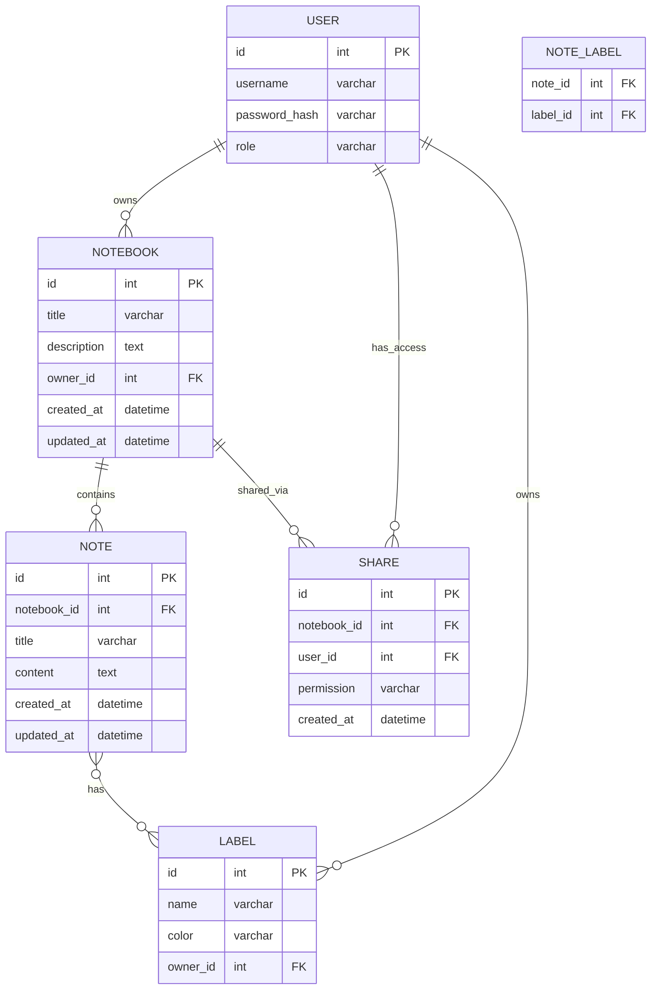

# Вариант 16 — ERD (диаграмма сущностей) — Заметки «Пишем вдвоём»

Файл содержит: 1) mermaid-диаграмму ERD; 2) ASCII-эскиз; 3) минимальный SQL DDL-скетч для создания таблиц.

## Mermaid ERD



## ASCII-эскиз

```text
User 1---* Notebook 1---* Note *---* Label
   \                              
    \-*- Share (user получает доступ к Notebook)
```

## Минимальный SQL DDL (пример, PostgreSQL)

```sql
CREATE TABLE users (
 id UUID PRIMARY KEY,
 username TEXT UNIQUE NOT NULL,
 password_hash TEXT NOT NULL,
 role TEXT NOT NULL CHECK (role IN ('admin','user'))
);

CREATE TABLE notebooks (
 id UUID PRIMARY KEY,
 title TEXT NOT NULL,
 description TEXT,
 owner_id UUID NOT NULL REFERENCES users(id) ON DELETE CASCADE,
 created_at TIMESTAMP WITH TIME ZONE DEFAULT now(),
 updated_at TIMESTAMP WITH TIME ZONE DEFAULT now()
);

CREATE TABLE notes (
 id UUID PRIMARY KEY,
 notebook_id UUID NOT NULL REFERENCES notebooks(id) ON DELETE CASCADE,
 title TEXT NOT NULL,
 content TEXT,
 created_at TIMESTAMP WITH TIME ZONE DEFAULT now(),
 updated_at TIMESTAMP WITH TIME ZONE DEFAULT now()
);

CREATE TABLE labels (
 id UUID PRIMARY KEY,
 name TEXT NOT NULL,
 color TEXT,
 owner_id UUID NOT NULL REFERENCES users(id) ON DELETE CASCADE
);

CREATE TABLE note_labels (
 note_id UUID NOT NULL REFERENCES notes(id) ON DELETE CASCADE,
 label_id UUID NOT NULL REFERENCES labels(id) ON DELETE CASCADE,
 PRIMARY KEY (note_id, label_id)
);

CREATE TABLE shares (
 id UUID PRIMARY KEY,
 notebook_id UUID NOT NULL REFERENCES notebooks(id) ON DELETE CASCADE,
 user_id UUID NOT NULL REFERENCES users(id) ON DELETE CASCADE,
 permission TEXT NOT NULL CHECK (permission IN ('read','write')),
 created_at TIMESTAMP WITH TIME ZONE DEFAULT now(),
 UNIQUE (notebook_id, user_id)
);
```
