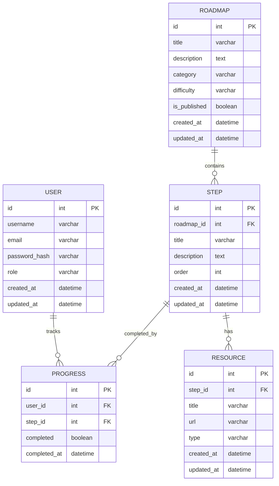

# Вариант 24 — ERD (диаграмма сущностей) — Roadmaps «Как стать джуном»

Файл содержит: 1) mermaid-диаграмму ERD; 2) ASCII-эскиз; 3) минимальный SQL DDL-скетч для создания таблиц.

## Mermaid ERD



## ASCII-эскиз

```text
Roadmap 1---* Step 1---* Resource
                  \
                   \---* Progress *---1 User
```

## Минимальный SQL DDL (пример, PostgreSQL)

```sql
CREATE TABLE users (
    id UUID PRIMARY KEY,
    username TEXT UNIQUE NOT NULL,
    email TEXT UNIQUE NOT NULL,
    password_hash TEXT NOT NULL,
    role TEXT NOT NULL CHECK (role IN ('admin','user')),
    created_at TIMESTAMP WITH TIME ZONE DEFAULT NOW(),
    updated_at TIMESTAMP WITH TIME ZONE DEFAULT NOW()
);

CREATE TABLE roadmaps (
    id UUID PRIMARY KEY,
    title TEXT NOT NULL,
    description TEXT,
    category TEXT,
    difficulty TEXT CHECK (difficulty IN ('beginner','intermediate','advanced')),
    is_published BOOLEAN DEFAULT FALSE,
    created_at TIMESTAMP WITH TIME ZONE DEFAULT NOW(),
    updated_at TIMESTAMP WITH TIME ZONE DEFAULT NOW(),
    deleted_at TIMESTAMP WITH TIME ZONE
);

CREATE TABLE steps (
    id UUID PRIMARY KEY,
    roadmap_id UUID NOT NULL REFERENCES roadmaps(id) ON DELETE CASCADE,
    title TEXT NOT NULL,
    description TEXT,
    "order" INTEGER NOT NULL,
    created_at TIMESTAMP WITH TIME ZONE DEFAULT NOW(),
    updated_at TIMESTAMP WITH TIME ZONE DEFAULT NOW()
);

CREATE TABLE resources (
    id UUID PRIMARY KEY,
    step_id UUID NOT NULL REFERENCES steps(id) ON DELETE CASCADE,
    title TEXT NOT NULL,
    url TEXT NOT NULL,
    type TEXT NOT NULL CHECK (type IN ('article','video','course')),
    created_at TIMESTAMP WITH TIME ZONE DEFAULT NOW(),
    updated_at TIMESTAMP WITH TIME ZONE DEFAULT NOW()
);

CREATE TABLE progress (
    id UUID PRIMARY KEY,
    user_id UUID NOT NULL REFERENCES users(id) ON DELETE CASCADE,
    step_id UUID NOT NULL REFERENCES steps(id) ON DELETE CASCADE,
    completed BOOLEAN DEFAULT FALSE,
    completed_at TIMESTAMP WITH TIME ZONE,
    UNIQUE(user_id, step_id)
);

-- Индексы для оптимизации запросов
CREATE INDEX idx_roadmaps_category ON roadmaps(category);
CREATE INDEX idx_roadmaps_difficulty ON roadmaps(difficulty);
CREATE INDEX idx_roadmaps_is_published ON roadmaps(is_published);
CREATE INDEX idx_steps_roadmap_id ON steps(roadmap_id);
CREATE INDEX idx_resources_step_id ON resources(step_id);
CREATE INDEX idx_progress_user_id ON progress(user_id);
CREATE INDEX idx_progress_step_id ON progress(step_id);
```
