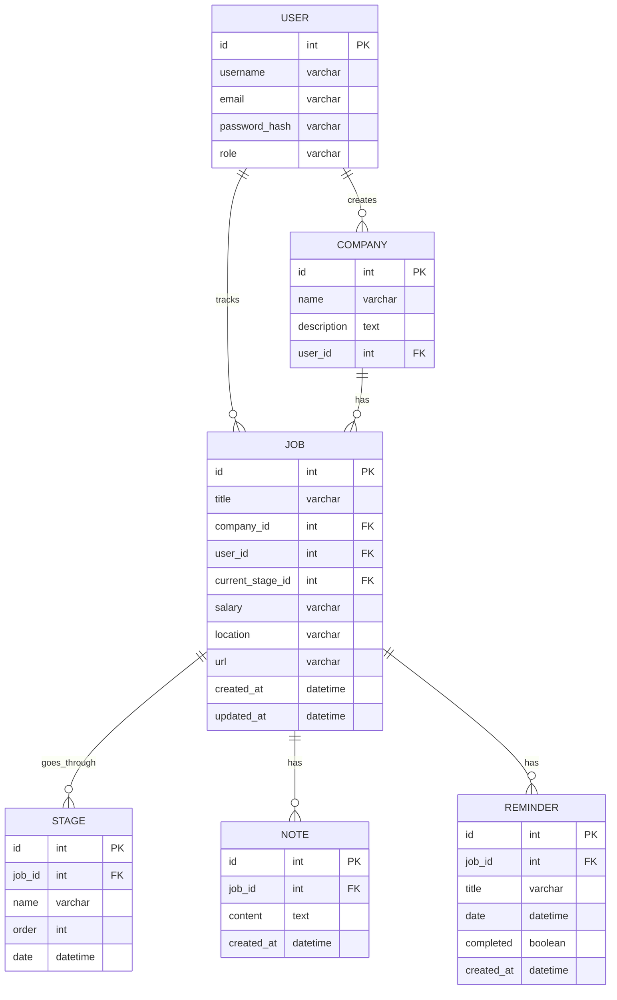

# Вариант 32 — ERD (диаграмма сущностей) — Поиск работы «Оффер где?»

Файл содержит: 1) mermaid-диаграмму ERD; 2) ASCII-эскиз; 3) минимальный SQL DDL-скетч для создания таблиц.

## Mermaid ERD



## ASCII-эскиз

```text
User 1---* Company
  |
  |
User 1---* Job *---1 Company
           |
           +---* Stage
           +---* Note
           +---* Reminder
```

## Минимальный SQL DDL (пример, PostgreSQL)

```sql
CREATE TABLE users (
 id UUID PRIMARY KEY,
 username TEXT UNIQUE NOT NULL,
 email TEXT UNIQUE NOT NULL,
 password_hash TEXT NOT NULL,
 role TEXT NOT NULL CHECK (role IN ('admin','user'))
);

CREATE TABLE companies (
 id UUID PRIMARY KEY,
 name TEXT NOT NULL,
 description TEXT,
 user_id UUID NOT NULL REFERENCES users(id) ON DELETE CASCADE
);

CREATE TABLE jobs (
 id UUID PRIMARY KEY,
 title TEXT NOT NULL,
 company_id UUID NOT NULL REFERENCES companies(id) ON DELETE CASCADE,
 user_id UUID NOT NULL REFERENCES users(id) ON DELETE CASCADE,
 current_stage_id UUID REFERENCES stages(id) ON DELETE SET NULL,
 salary TEXT,
 location TEXT,
 url TEXT,
 created_at TIMESTAMP WITH TIME ZONE DEFAULT NOW(),
 updated_at TIMESTAMP WITH TIME ZONE DEFAULT NOW()
);

CREATE TABLE stages (
 id UUID PRIMARY KEY,
 job_id UUID NOT NULL REFERENCES jobs(id) ON DELETE CASCADE,
 name TEXT NOT NULL,
 order INT NOT NULL,
 date TIMESTAMP WITH TIME ZONE
);

CREATE TABLE notes (
 id UUID PRIMARY KEY,
 job_id UUID NOT NULL REFERENCES jobs(id) ON DELETE CASCADE,
 content TEXT NOT NULL,
 created_at TIMESTAMP WITH TIME ZONE DEFAULT NOW()
);

CREATE TABLE reminders (
 id UUID PRIMARY KEY,
 job_id UUID NOT NULL REFERENCES jobs(id) ON DELETE CASCADE,
 title TEXT NOT NULL,
 date TIMESTAMP WITH TIME ZONE NOT NULL,
 completed BOOLEAN DEFAULT FALSE,
 created_at TIMESTAMP WITH TIME ZONE DEFAULT NOW()
);
```

Примечания:

- Все связи через внешние ключи (FK) с каскадным удалением для зависимых сущностей.
- Job.current_stage_id может быть NULL (SET NULL при удалении Stage).
- Индексы рекомендуется добавить на: user_id, company_id, job_id для ускорения запросов.
