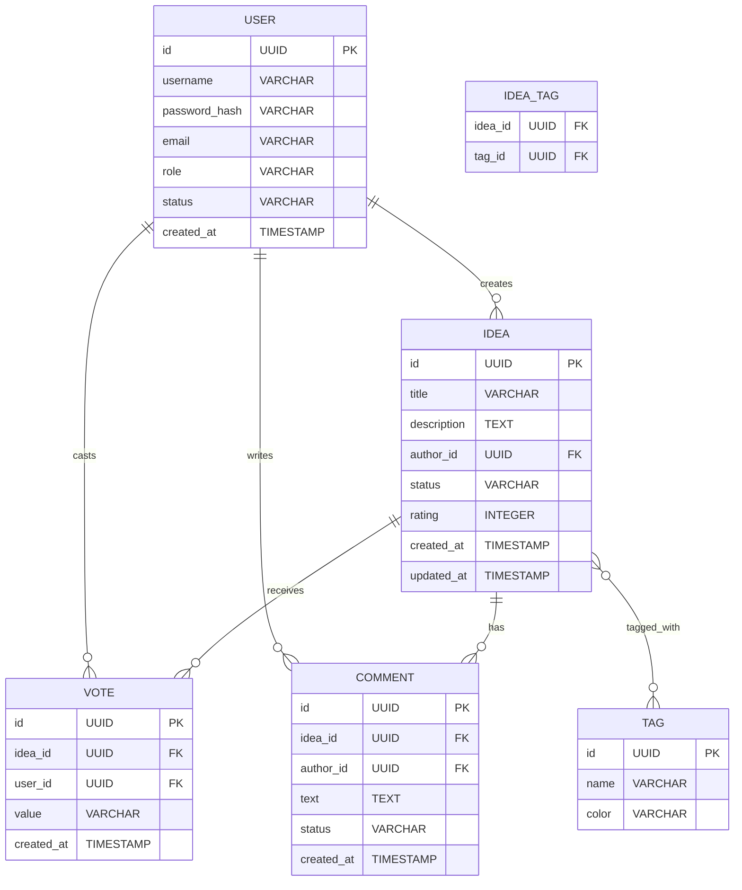

# Вариант 36 — ERD (диаграмма сущностей) — Идеи «Лайк за мысль»

Файл содержит: 1) mermaid-диаграмму ERD; 2) ASCII-эскиз; 3) минимальный SQL DDL-скетч для создания таблиц.

## Mermaid ERD



## ASCII-эскиз

```
User 1---* Idea *---* Tag
      \      |
       \     *---* Vote
        \    *---* Comment
         \--*
```

## Минимальный SQL DDL (пример, PostgreSQL)

```sql
CREATE TABLE users (
  id UUID PRIMARY KEY DEFAULT gen_random_uuid(),
  username VARCHAR UNIQUE NOT NULL,
  password_hash VARCHAR NOT NULL,
  email VARCHAR UNIQUE NOT NULL,
  role VARCHAR NOT NULL CHECK (role IN ('admin','user')),
  status VARCHAR NOT NULL CHECK (status IN ('active','banned')) DEFAULT 'active',
  created_at TIMESTAMP WITH TIME ZONE DEFAULT now()
);

CREATE TABLE ideas (
  id UUID PRIMARY KEY DEFAULT gen_random_uuid(),
  title VARCHAR NOT NULL,
  description TEXT NOT NULL,
  author_id UUID NOT NULL REFERENCES users(id) ON DELETE CASCADE,
  status VARCHAR NOT NULL CHECK (status IN ('draft','pending','approved','rejected')) DEFAULT 'pending',
  rating INTEGER DEFAULT 0,
  created_at TIMESTAMP WITH TIME ZONE DEFAULT now(),
  updated_at TIMESTAMP WITH TIME ZONE DEFAULT now()
);

CREATE TABLE tags (
  id UUID PRIMARY KEY DEFAULT gen_random_uuid(),
  name VARCHAR UNIQUE NOT NULL,
  color VARCHAR DEFAULT '#6B7280'
);

CREATE TABLE idea_tags (
  idea_id UUID NOT NULL REFERENCES ideas(id) ON DELETE CASCADE,
  tag_id UUID NOT NULL REFERENCES tags(id) ON DELETE CASCADE,
  PRIMARY KEY (idea_id, tag_id)
);

CREATE TABLE votes (
  id UUID PRIMARY KEY DEFAULT gen_random_uuid(),
  idea_id UUID NOT NULL REFERENCES ideas(id) ON DELETE CASCADE,
  user_id UUID NOT NULL REFERENCES users(id) ON DELETE CASCADE,
  value VARCHAR NOT NULL CHECK (value IN ('up','down')),
  created_at TIMESTAMP WITH TIME ZONE DEFAULT now(),
  UNIQUE(idea_id, user_id)
);

CREATE TABLE comments (
  id UUID PRIMARY KEY DEFAULT gen_random_uuid(),
  idea_id UUID NOT NULL REFERENCES ideas(id) ON DELETE CASCADE,
  author_id UUID NOT NULL REFERENCES users(id) ON DELETE CASCADE,
  text TEXT NOT NULL,
  status VARCHAR NOT NULL CHECK (status IN ('active','deleted')) DEFAULT 'active',
  created_at TIMESTAMP WITH TIME ZONE DEFAULT now()
);
```
