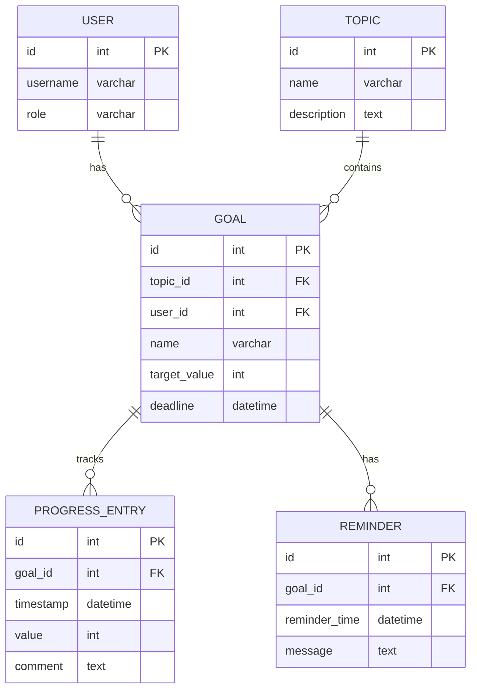

# Вариант 14 — Ключевые сущности, связи и API (эскиз)

Сущности (основные)

- User
  - id: UUID
  - username: string (unique, латиница+цифры+underscore, 3-30 символов)
  - email: string (unique, валидный email)
  - password_hash: string
  - role: enum [admin, user]
  - created_at: datetime

- Topic
  - id: UUID
  - name: string
  - description: string
  - created_at: datetime

- Goal
  - id: UUID
  - topic_id: reference -> Topic.id
  - user_id: reference -> User.id
  - name: string
  - description: string
  - target_value: number (целевое значение для достижения)
  - current_progress: **вычисляется как SUM(ProgressEntry.value) для данной Goal**
  - progress_percentage: **вычисляется как (current_progress / target_value) * 100**
  - deadline: datetime
  - created_at: datetime

- ProgressEntry
  - id: UUID
  - goal_id: reference -> Goal.id
  - timestamp: datetime
  - value: number
  - comment: string

Связи (ER-эскиз)

- Topic 1..* Goal (тема имеет цели)
- User 1..* Goal (пользователь имеет цели)
- Goal 1..* ProgressEntry (цель имеет записи прогресса)

Обязательные поля и ограничения (кратко)

- unique(User.username)
- Topic.name not null
- Goal.topic_id → Topic.id (FK, not null)
- Goal.user_id → User.id (FK, not null)
- ProgressEntry.goal_id → Goal.id (FK, not null)

API — верхнеуровневые ресурсы и операции

- /users
  - GET /users (admin only)
  - POST /users (admin only, для создания пользователей администратором)
  - GET /users/{id} (admin or self)
  - PUT /users/{id} (admin or self, частичное обновление)
  - DELETE /users/{id} (admin only)

- /topics
  - GET /topics (list)
  - POST /topics (admin)
  - GET /topics/{id}
  - PUT /topics/{id} (admin)
  - DELETE /topics/{id} (admin)

- /goals
  - GET /goals (list all; **scope:** user видит только свои, admin видит все)
    - Query params: ?userId=&topicId=&limit=&offset=
  - POST /goals (admin only, назначает цели пользователям)
  - GET /goals/{id} (owner or admin)
  - PUT /goals/{id} (owner может редактировать name/description/deadline; admin может всё)
  - DELETE /goals/{id} (admin only)

- /progress
  - POST /progress (создание записи; **проверка:** goal.userId === req.user.id or admin)
  - GET /progress (список записей; **scope:** user видит только свои, admin видит все)
    - Query params: ?goalId=&userId=&from=&to=&limit=&offset=
  - GET /progress/{id} (owner or admin)
  - PUT /progress/{id} (owner or admin)
  - DELETE /progress/{id} (owner or admin)

- /reports
  - GET /reports/user/{id}?from=&to= (**права:** admin or self)
    - Возвращает статистику пользователя для построения диаграмм
  - GET /reports/topic/{id}?from=&to= (admin only)
    - Возвращает статистику по теме

Дополнительно (бонусы)

- Напоминания: /reminders (CRUD для настройки уведомлений)
- Геймификация: бейджи, достижения за выполнение целей
- Документация API (OpenAPI/Swagger)
- Тесты: unit + интеграционные

---

## Подробные операции API, схемы и поведение

Общие принципы

- Ответы в формате: `{ "status": "ok" | "error", "data"?: ..., "error"?: {code, message, fields?} }`
- Пагинация: `limit` и `offset` (по умолчанию limit=50).
- Аутентификация: `Authorization: Bearer <jwt>`; роли: `admin`, `user`.

Примеры ошибок (JSON)

```json
{
  "status": "error",
  "error": { "code": "validation_failed", "message": "Validation failed", "fields": { "name": "required" } }
}
```

Auth

- POST `/auth/register` — `{username, email, password}` → `201 {id, username, email, role}` (роль по умолчанию: `user`)
- POST `/auth/login` — `{email, password}` → `200 {accessToken, refreshToken, user: {id, username, email, role}}`
- POST `/auth/refresh` — `{refreshToken}` → `200 {accessToken}`

**Примечание:** Разница между `/auth/register` и `POST /users`:

- `/auth/register` — самостоятельная регистрация (создаётся только роль `user`)
- `POST /users` (admin) — создание пользователей администратором (можно указать роль)

Users

- GET `/users?limit=&offset=` — Admin only
- GET `/users/{id}` — Admin или self
- POST `/users` — Admin only (payload: `{username, email, password, role?}`)
  - Позволяет создавать пользователей с указанием роли
- PUT `/users/{id}` — Admin (любые поля) или self (только email, password)
- DELETE `/users/{id}` — Admin only

Topics

- GET `/topics?limit=&offset=` — список тем
- POST `/topics` — Admin (payload: `{name,description}`)
- GET `/topics/{id}` — детали темы, включает список целей
- PUT `/topics/{id}` — Admin
- DELETE `/topics/{id}` — Admin

Goals

- POST `/goals` — Admin only `{topicId, userId, name, description, targetValue, deadline}` → `201 {id, ...}`
  - Администратор создаёт цели и назначает их пользователям
- GET `/goals?userId=&topicId=&limit=&offset=` — список целей
  - **Scope:** user видит только свои цели (WHERE user_id = req.user.id), admin видит все
- GET `/goals/{id}` — детали цели с вычисленным прогрессом
  - Response: `{id, name, description, targetValue, currentProgress, progressPercentage, deadline, ...}`
  - **Права:** owner or admin
- PUT `/goals/{id}` — частичное обновление
  - **Owner:** может менять name, description, deadline
  - **Admin:** может менять всё (включая userId, topicId, targetValue)
- DELETE `/goals/{id}` — Admin only

Progress (записи прогресса)

- POST `/progress` — создание записи

  - Payload (пример):

  ```json
  {
    "goalId": "goal-uuid",
    "timestamp": "2025-10-13T10:00:00Z",
    "value": 10,
    "comment": "Выполнено 10 задач"
  }
  ```

  - Response: `201 {id, goalId, timestamp, value, comment}`

- GET `/progress?goalId=&from=&to=&limit=&offset=` — список записей прогресса

Reports (отчёты)

- GET `/reports/user/{userId}?from=&to=` — статистика пользователя

  - **Права:** admin or self (userId === req.user.id)
  - Response (для построения диаграмм на клиенте):

  ```json
  {
    "userId": "uuid",
    "username": "string",
    "totalGoals": 10,
    "completedGoals": 7,
    "inProgressGoals": 3,
    "progressPercentage": 70,
    "topicsSummary": [
      {
        "topicId": "uuid",
        "topicName": "Математика",
        "goalsCount": 5,
        "completedCount": 4,
        "progressPercentage": 80
      }
    ],
    "progressOverTime": [
      {"date": "2025-12-01", "totalProgress": 30},
      {"date": "2025-12-15", "totalProgress": 70}
    ]
  }
  ```

- GET `/reports/topic/{topicId}?from=&to=` — статистика по теме

  - **Права:** admin only
  - Response:

  ```json
  {
    "topicId": "uuid",
    "topicName": "Математика",
    "totalGoals": 15,
    "completedGoals": 10,
    "progressPercentage": 67,
    "usersSummary": [
      {
        "userId": "uuid",
        "username": "ivanov",
        "goalsCount": 5,
        "completedCount": 3,
        "progressPercentage": 60
      }
    ]
  }
  ```

Reminders (НЕ входит в MVP, только бонус)

**ВАЖНО:** Сущность Reminder реализуется только после MVP. В минимальной версии её нет.

- POST `/reminders` — создать напоминание `{goalId, reminderTime, message}`
- GET `/reminders?userId=` — список напоминаний пользователя
- DELETE `/reminders/{id}` — удалить напоминание

---

## Механизмы безопасности и проверки прав

### Scope-ограничения (уровень базы данных)

```typescript
// Пример middleware для фильтрации запросов
function applyScopeFilter(req, query) {
  if (req.user.role !== 'admin') {
    query.where.userId = req.user.id;  // Пользователь видит только свои записи
  }
  return query;
}
```

### Проверка прав на уровне записи

```typescript
// Пример для PUT /goals/{id}
const goal = await Goal.findById(id);
if (req.user.role !== 'admin' && goal.userId !== req.user.id) {
  throw new ForbiddenError('У вас нет прав на редактирование этой цели');
}
```

### Валидация на сервере (Zod)

```typescript
const createGoalSchema = z.object({
  topicId: z.string().uuid(),
  userId: z.string().uuid(),
  name: z.string().min(1, 'Введите название цели'),
  description: z.string().optional(),
  targetValue: z.number().positive('Целевое значение должно быть положительным'),
  deadline: z.string().datetime().optional()
});
```

---

## ERD (диаграмма сущностей)

Mermaid-диаграмма (если рендер поддерживается):



ASCII-эскиз (если mermaid не рендерится):

```text
User 1---* Goal *---1 Topic
              |
              1
              |
              *
         ProgressEntry
```

---

AC — критерии приёмки для функционала диаграмм (MVP)

- AC1: При добавлении ProgressEntry обновляется процент выполнения Goal.
- AC2: GET `/reports/user/{id}` возвращает диаграммы прогресса с визуализацией.
- AC3: Диаграммы отображают прогресс по времени и по целям.
