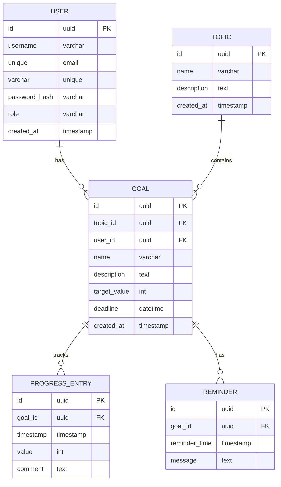

# Вариант 14 — ERD (диаграмма сущностей) — Прогресс «До сессии успею»

Файл содержит: 1) mermaid-диаграмму ERD; 2) ASCII-эскиз; 3) минимальный SQL DDL-скетч для создания таблиц.

## Mermaid ERD



## ASCII-эскиз

```
User 1---* Goal *---1 Topic
              |
              1
              |
              *
         ProgressEntry
              |
              1
              |
              *
          Reminder
```

## Минимальный SQL DDL (пример, PostgreSQL)

```sql
CREATE TABLE users (
 id UUID PRIMARY KEY DEFAULT gen_random_uuid(),
 username TEXT UNIQUE NOT NULL CHECK (username ~ '^[a-zA-Z0-9_]{3,30}$'),
 email TEXT UNIQUE NOT NULL CHECK (email ~ '^[^@]+@[^@]+\.[^@]+$'),
 password_hash TEXT NOT NULL,
 role TEXT NOT NULL DEFAULT 'user' CHECK (role IN ('admin','user')),
 created_at TIMESTAMP WITH TIME ZONE DEFAULT now()
);

CREATE TABLE topics (
 id UUID PRIMARY KEY DEFAULT gen_random_uuid(),
 name TEXT NOT NULL,
 description TEXT,
 created_at TIMESTAMP WITH TIME ZONE DEFAULT now()
);

CREATE TABLE goals (
 id UUID PRIMARY KEY DEFAULT gen_random_uuid(),
 topic_id UUID NOT NULL REFERENCES topics(id) ON DELETE CASCADE,
 user_id UUID NOT NULL REFERENCES users(id) ON DELETE CASCADE,
 name TEXT NOT NULL,
 description TEXT,
 target_value INTEGER NOT NULL CHECK (target_value > 0),
 deadline TIMESTAMP WITH TIME ZONE,
 created_at TIMESTAMP WITH TIME ZONE DEFAULT now()
);

-- Индексы для быстрого поиска целей по пользователю и теме
CREATE INDEX idx_goals_user_id ON goals(user_id);
CREATE INDEX idx_goals_topic_id ON goals(topic_id);

CREATE TABLE progress_entries (
 id UUID PRIMARY KEY DEFAULT gen_random_uuid(),
 goal_id UUID NOT NULL REFERENCES goals(id) ON DELETE CASCADE,
 timestamp TIMESTAMP WITH TIME ZONE NOT NULL DEFAULT now(),
 value INTEGER NOT NULL CHECK (value >= 0),
 comment TEXT CHECK (length(comment) <= 5000)
);

-- Индекс для быстрого поиска прогресса по цели
CREATE INDEX idx_progress_goal_id ON progress_entries(goal_id);
CREATE INDEX idx_progress_timestamp ON progress_entries(timestamp);

-- ВАЖНО: Таблица reminders НЕ входит в MVP и создаётся только при реализации бонусной функциональности
CREATE TABLE reminders (
 id UUID PRIMARY KEY DEFAULT gen_random_uuid(),
 goal_id UUID NOT NULL REFERENCES goals(id) ON DELETE CASCADE,
 reminder_time TIMESTAMP WITH TIME ZONE NOT NULL,
 message TEXT NOT NULL,
 created_at TIMESTAMP WITH TIME ZONE DEFAULT now()
);

CREATE INDEX idx_reminders_goal_id ON reminders(goal_id);
CREATE INDEX idx_reminders_time ON reminders(reminder_time);
```
