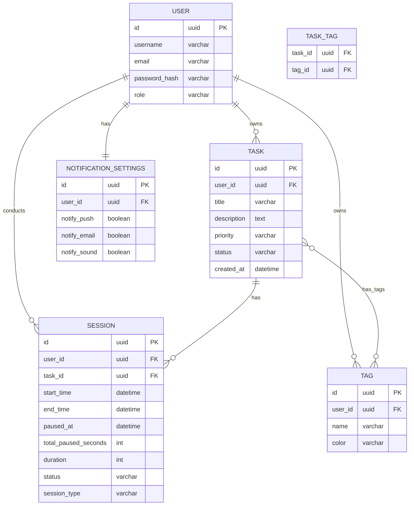

# Вариант 27 — ERD (диаграмма сущностей) — Pomodoro «Томатная продуктивность»

Файл содержит: 1) mermaid-диаграмму ERD; 2) ASCII-эскиз; 3) минимальный SQL DDL-скетч для создания таблиц.

## Mermaid ERD



## ASCII-эскиз

```
User 1---* Task 1---* Session
     |          \
     |           *---* Tag
     |                 
     *--- Tag
     |
     *--- Session
     |
     1--- NotificationSettings
```

## Минимальный SQL DDL (пример, PostgreSQL)

```sql
CREATE TABLE users (
    id UUID PRIMARY KEY,
    username TEXT UNIQUE NOT NULL,
    email TEXT UNIQUE NOT NULL,
    password_hash TEXT NOT NULL,
    role TEXT NOT NULL CHECK (role IN ('admin','user'))
);

CREATE TABLE tasks (
    id UUID PRIMARY KEY,
    user_id UUID NOT NULL REFERENCES users(id) ON DELETE CASCADE,
    title TEXT NOT NULL,
    description TEXT,
    priority TEXT CHECK (priority IN ('low','medium','high')),
    status TEXT NOT NULL CHECK (status IN ('pending','in_progress','completed')),
    created_at TIMESTAMP WITH TIME ZONE DEFAULT now()
);

CREATE TABLE tags (
    id UUID PRIMARY KEY,
    user_id UUID NOT NULL REFERENCES users(id) ON DELETE CASCADE,
    name TEXT NOT NULL,
    color TEXT
);

CREATE TABLE task_tags (
    task_id UUID NOT NULL REFERENCES tasks(id) ON DELETE CASCADE,
    tag_id UUID NOT NULL REFERENCES tags(id) ON DELETE CASCADE,
    PRIMARY KEY (task_id, tag_id)
);

CREATE TABLE sessions (
    id UUID PRIMARY KEY,
    user_id UUID NOT NULL REFERENCES users(id) ON DELETE CASCADE,
    task_id UUID REFERENCES tasks(id) ON DELETE SET NULL,
    start_time TIMESTAMP WITH TIME ZONE NOT NULL,
    end_time TIMESTAMP WITH TIME ZONE,
    paused_at TIMESTAMP WITH TIME ZONE,
    total_paused_seconds INTEGER DEFAULT 0,
    duration INTEGER,
    status TEXT NOT NULL CHECK (status IN ('running','paused','completed','interrupted')),
    session_type TEXT NOT NULL CHECK (session_type IN ('pomodoro','short_break','long_break'))
);

CREATE TABLE notification_settings (
    id UUID PRIMARY KEY,
    user_id UUID UNIQUE NOT NULL REFERENCES users(id) ON DELETE CASCADE,
    notify_push BOOLEAN DEFAULT true,
    notify_email BOOLEAN DEFAULT false,
    notify_sound BOOLEAN DEFAULT true
);
```
