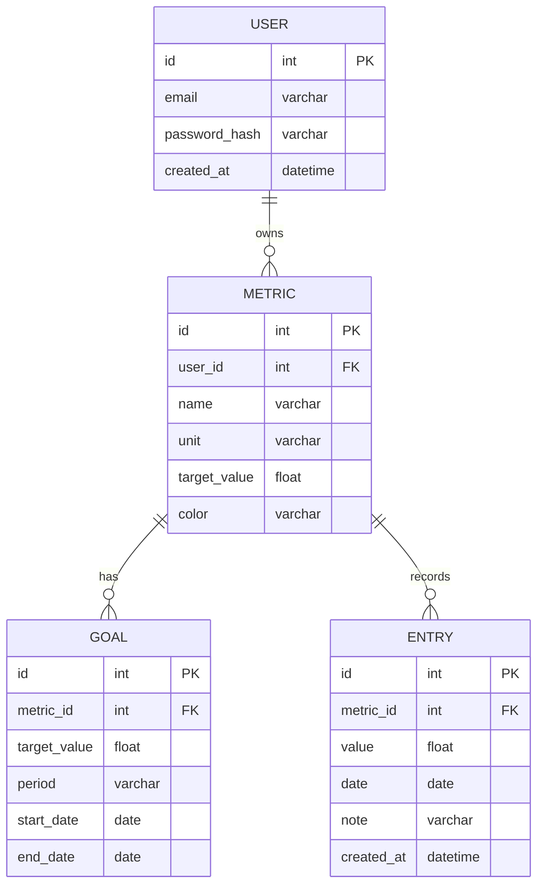

# R1 — ERD (диаграмма сущностей)

Диаграмма и минимальный SQL DDL, адаптированы к фактическим моделям проекта.

## Mermaid ERD



## ASCII-эскиз

```
User 1---* Metric 1---* Goal
               \
                \-*- Entry (many by date)
```

## Минимальный SQL DDL (пример, SQLite/Postgres)

```sql
CREATE TABLE users (
    id INTEGER PRIMARY KEY,
    email TEXT UNIQUE NOT NULL,
    password_hash TEXT NOT NULL,
    created_at TIMESTAMP
);

CREATE TABLE metrics (
    id INTEGER PRIMARY KEY,
    user_id INTEGER NOT NULL REFERENCES users(id) ON DELETE CASCADE,
    name TEXT NOT NULL,
    unit TEXT,
    target_value REAL,
    color TEXT
);

CREATE INDEX idx_metrics_user_id ON metrics(user_id);

CREATE TABLE goals (
    id INTEGER PRIMARY KEY,
    metric_id INTEGER NOT NULL REFERENCES metrics(id) ON DELETE CASCADE,
    target_value REAL NOT NULL,
    period TEXT NOT NULL,
    start_date DATE NOT NULL,
    end_date DATE
);

CREATE TABLE entries (
    id INTEGER PRIMARY KEY,
    metric_id INTEGER NOT NULL REFERENCES metrics(id) ON DELETE CASCADE,
    value REAL NOT NULL,
    date DATE NOT NULL,
    note TEXT,
    created_at TIMESTAMP
);

CREATE INDEX idx_entries_metric_date ON entries(metric_id, date);
```
