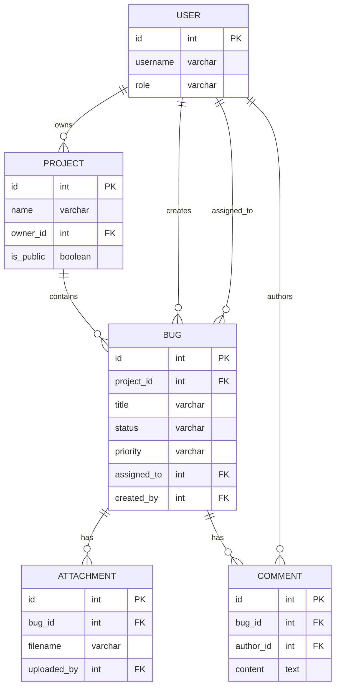

# Вариант 11 — Ключевые сущности, связи и API (эскиз)

Сущности (основные)

- User
  - id: UUID
  - username: string (unique)
  - email: string (unique)
  - password_hash: string
  - role: enum [admin, manager, developer, user]
  - created_at: datetime

- Project
  - id: UUID
  - name: string
  - description: string
  - owner_id: reference -> User.id
  - is_public: boolean
  - created_at: datetime
  - updated_at: datetime

- ProjectMember
  - id: UUID
  - project_id: reference -> Project.id
  - user_id: reference -> User.id
  - role: enum [owner, manager, developer, viewer]
  - joined_at: datetime

- Bug
  - id: UUID
  - project_id: reference -> Project.id
  - title: string
  - description: text
  - status: enum [new, in_progress, testing, done, closed]
  - priority: enum [low, medium, high, critical]
  - assigned_to: reference -> User.id (nullable)
  - created_by: reference -> User.id
  - created_at: datetime
  - updated_at: datetime

- Attachment
  - id: UUID
  - bug_id: reference -> Bug.id
  - filename: string
  - file_path: string
  - uploaded_by: reference -> User.id
  - uploaded_at: datetime

- Comment
  - id: UUID
  - bug_id: reference -> Bug.id
  - author_id: reference -> User.id
  - content: text
  - created_at: datetime

Связи (ER-эскиз)

- User 1..* Project (пользователь владеет проектами)
- Project *..* User через ProjectMember (участники проекта)
- Project 1..* Bug (проект содержит баги)
- User 1..* Bug (пользователь создаёт баги)
- Bug 1..* Attachment (баг имеет вложения)
- Bug 1..* Comment (баг имеет комментарии)

Обязательные поля и ограничения (кратко)

- unique(User.username)
- unique(User.email)
- Project.owner_id → User.id (FK, not null)
- ProjectMember.project_id → Project.id (FK, not null, cascade delete)
- ProjectMember.user_id → User.id (FK, not null, cascade delete)
- unique(ProjectMember.project_id, ProjectMember.user_id) - один пользователь один раз в проекте
- Bug.project_id → Project.id (FK, not null)
- Bug.created_by → User.id (FK, not null)
- Bug.assigned_to → User.id (FK, nullable, set null on delete)
- Attachment.bug_id → Bug.id (FK, not null)
- Comment.bug_id → Bug.id (FK, not null)

API — верхнеуровневые ресурсы и операции

- /users
  - GET /users (admin)
  - POST /users (admin)
  - GET /users/{id}
  - PUT /users/{id}
  - DELETE /users/{id}

- /projects
  - GET /projects (list, filter by owner, isPublic)
  - POST /projects
  - GET /projects/{id}
  - PUT /projects/{id}
  - DELETE /projects/{id}
  - GET /projects/{id}/members (список участников)
  - POST /projects/{id}/members (добавить участника)
  - DELETE /projects/{id}/members/{userId} (удалить участника)

- /bugs
  - GET /bugs (filter by project/status/priority/assignee)
  - POST /bugs
  - GET /bugs/{id}
  - PUT /bugs/{id}
  - DELETE /bugs/{id}

- /attachments
  - POST /attachments (upload file)
  - GET /attachments?bug_id=
  - GET /attachments/{id}
  - DELETE /attachments/{id}

- /comments
  - GET /comments?bug_id=
  - POST /comments
  - PUT /comments/{id}
  - DELETE /comments/{id}

## Правила публичности и доступа (MVP)

- **Публичные проекты** (Project.is_public = true):
  - Видны всем пользователям
  - Баги публичных проектов видны всем пользователям
  - Создавать баги могут все авторизованные пользователи

- **Приватные проекты** (Project.is_public = false):
  - Видны только участникам (ProjectMember) и администраторам
  - Баги приватных проектов видны только участникам проекта и администраторам
  - Создавать/редактировать баги могут только участники проекта

- **Права участников проекта** (ProjectMember.role):
  - **owner**: полный доступ (редактирование проекта, управление участниками, все операции с багами)
  - **manager**: управление багами (CRUD, назначение, изменение приоритетов/статусов)
  - **developer**: работа с назначенными багами (редактирование, смена статуса, комментарии)
  - **viewer**: только просмотр проекта и багов

## Ограничения безопасности (MVP)

- Загрузка файлов (Attachments):
  - Максимальный размер: 10 MB
  - Разрешённые типы: image/*, application/pdf, text/plain, text/csv
  - Хранение: локальная файловая система (папка `uploads/`)
  - Скачивание: GET /attachments/{id}/download

- Rate limiting:
  - Auth endpoints (/auth/login, /auth/register): 5 запросов в минуту на IP
  - Остальные endpoints: 100 запросов в минуту на пользователя

- Валидация:
  - Все пользовательские вводы валидируются через Zod
  - HTML в комментариях санитизируется (защита от XSS)
  - SQL injection предотвращается через Prisma ORM

Дополнительно (бонусы)

- Документация API (OpenAPI/Swagger)
- Тесты: unit + интеграционные для фильтров и доски
- История изменений багов (BugAuditLog) - отложено на будущее

---

## Подробные операции API, схемы и поведение

Общие принципы

- Ответы в формате: `{ "status": "ok" | "error", "data"?: ..., "error"?: {code, message, fields?} }`
- Пагинация: `limit` и `offset` (по умолчанию limit=50).
- Аутентификация: `Authorization: Bearer <jwt>`; роли: `admin`, `manager`, `developer`, `user`.

Примеры ошибок (JSON)

```json
{
  "status": "error",
  "error": { "code": "validation_failed", "message": "Validation failed", "fields": { "title": "required" } }
}
```

Auth

- POST `/auth/register` — регистрация (только для создания первого admin, затем отключить)
  - Payload: `{username, email, password}`
  - Response: `201 {id, username, email, role}`
  - Примечание: после создания первого администратора, регистрация доступна только через Admin → POST /users

- POST `/auth/login` — `{email, password}` → `200 {accessToken, refreshToken, user}`
- POST `/auth/refresh` — `{refreshToken}` → `200 {accessToken}`

Users

- GET `/users?limit=&offset=` — Admin (список всех пользователей)
- GET `/users/{id}` — Admin или self
- POST `/users` — Admin (создание пользователя)
  - Payload: `{username, email, password, role?}`
  - Role по умолчанию: 'user'
- PUT `/users/{id}` — Admin или self (частичное обновление)
  - Self может изменять только username, email, password
  - Admin может изменять всё, включая role
- DELETE `/users/{id}` — Admin
  - Запрещено удалять пользователя, если у него есть баги (created_by)
  - При удалении: assigned_to в багах устанавливается в NULL

Projects

- GET `/projects?ownerId=&isPublic=&limit=&offset=` — список проектов
  - Admin: видит все проекты
  - Остальные: публичные проекты + проекты, где они участники (ProjectMember)

- POST `/projects` — Admin (создание проекта)
  - Payload: `{name, description, ownerId?, isPublic?}`
  - ownerId по умолчанию: текущий пользователь
  - isPublic по умолчанию: false
  - Автоматически создаётся ProjectMember с ролью 'owner' для владельца

- GET `/projects/{id}` — детали проекта с кратким списком багов
  - Доступ: Admin, участники проекта (ProjectMember), или публичный проект

- PUT `/projects/{id}` — Admin или owner проекта

- DELETE `/projects/{id}` — Admin
  - Каскадно удаляются все баги, комментарии, вложения, ProjectMember

- GET `/projects/{id}/members` — список участников проекта
  - Доступ: Admin, участники проекта
  - Response: `200 [{userId, username, email, role, joinedAt}]`

- POST `/projects/{id}/members` — добавить участника
  - Доступ: Admin, owner или manager проекта
  - Payload: `{userId, role}`
  - Role: 'manager' | 'developer' | 'viewer'

- DELETE `/projects/{id}/members/{userId}` — удалить участника
  - Доступ: Admin, owner проекта
  - Нельзя удалить owner'а проекта

Bugs

- GET `/bugs?projectId=&status=&priority=&assignedTo=&createdBy=&limit=&offset=` — список с фильтрами
  - Доступ: Admin видит все; остальные видят баги публичных проектов + проектов, где они участники

- POST `/bugs` — создание бага
  - Доступ: Admin, участники проекта (ProjectMember), или пользователи для публичных проектов
  - Payload: `{projectId, title, description, priority?, status?}`
  - Status по умолчанию: 'new'
  - Priority по умолчанию: 'medium'
  - created_by автоматически устанавливается из JWT

- GET `/bugs/{id}` — детали бага с комментариями и вложениями
  - Доступ: Admin, участники проекта, или публичный проект

- PUT `/bugs/{id}` — редактирование бага
  - Доступ:
    - Admin: все поля
    - Owner/Manager проекта (ProjectMember): все поля
    - Developer: только assigned_to=себе или created_by=себе, ограниченные поля (status, description)
    - Автор (created_by): только description
  - Payload: частичное обновление полей

- DELETE `/bugs/{id}` — Admin, owner/manager проекта

- PATCH `/bugs/{id}/assign` — назначить баг на разработчика
  - Доступ: Admin, owner/manager проекта
  - Payload: `{assignedTo: userId | null}`

- PATCH `/bugs/{id}/status` — изменить статус
  - Доступ: Admin, owner/manager проекта, developer (если assigned_to=себе)
  - Payload: `{status: 'new' | 'in_progress' | 'testing' | 'done' | 'closed'}`

Attachments

- POST `/attachments` — загрузка файла
  - Доступ: Admin, участники проекта бага
  - Payload: multipart/form-data с `bugId` и `file`
  - Валидация: max 10MB, типы: image/*, application/pdf, text/plain, text/csv
  - Response: `201 {id, filename, url}`

- GET `/attachments?bugId=` — список вложений для бага
  - Доступ: Admin, участники проекта бага, или публичный проект

- GET `/attachments/{id}/download` — скачивание файла
  - Доступ: Admin, участники проекта бага, или публичный проект

- DELETE `/attachments/{id}` — Admin, автор вложения (uploaded_by), owner/manager проекта

Comments

- GET `/comments?bugId=&limit=&offset=` — список комментариев
  - Доступ: Admin, участники проекта бага, или публичный проект
  - Для MVP: возвращаем все комментарии без пагинации (если < 100)

- POST `/comments` — добавить комментарий
  - Доступ: Admin, участники проекта бага, пользователи для публичных проектов
  - Payload: `{bugId, content}`
  - content: текст с санитизацией HTML (XSS защита)

- PUT `/comments/{id}` — редактировать комментарий
  - Доступ: автор комментария (author_id) или Admin
  - Payload: `{content}`

- DELETE `/comments/{id}` — удалить комментарий
  - Доступ: автор комментария, Admin, owner/manager проекта

Board (доска багов)

- GET `/projects/{id}/board` — возвращает баги проекта, сгруппированные по статусам для Kanban-доски
  - Доступ: Admin, участники проекта, или публичный проект
  - Response: `{new: [...], in_progress: [...], testing: [...], done: [...], closed: [...]}`
  - Поддерживает фильтры: ?priority=&assignedTo=

---

## ERD (диаграмма сущностей)

Mermaid-диаграмма (если рендер поддерживается):



ASCII-эскиз (если mermaid не рендерится):

```text
User 1---* Project 1---* Bug 1---* Attachment
                          |
                          *---* Comment
User ----* Bug (создатель и исполнитель)
```

---

AC — критерии приёмки для функционала фильтров и доски (MVP)

- AC1: GET `/bugs?status=in_progress` возвращает только баги со статусом "В работе".
- AC2: GET `/projects/{id}/board` возвращает баги, сгруппированные по статусам (new, in_progress, testing, done, closed).
- AC3: Доска корректно отображает баги с возможностью фильтрации по приоритету и назначенному разработчику.
