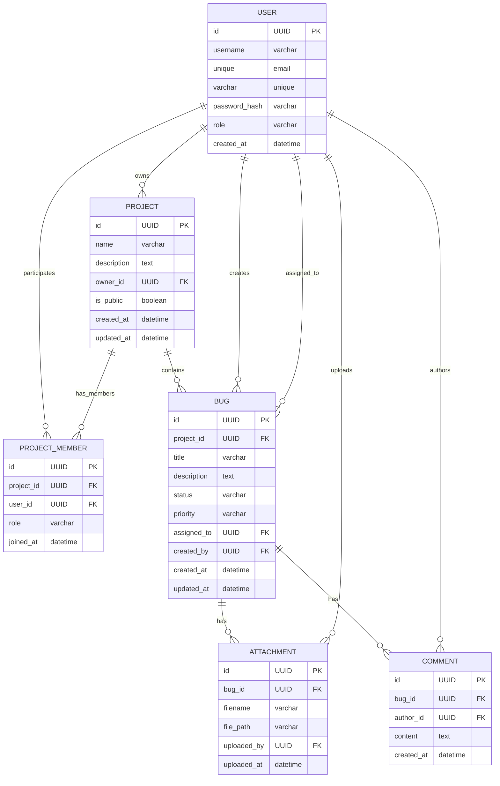

# Вариант 11 — ERD (диаграмма сущностей) — Баг-трекер «Не баг, а фича?»

Файл содержит: 1) mermaid-диаграмму ERD; 2) ASCII-эскиз; 3) минимальный SQL DDL-скетч для создания таблиц.

## Mermaid ERD



## ASCII-эскиз

```
User 1---* Project (owner)
User *---* Project через ProjectMember (участники)
Project 1---* Bug 1---* Attachment
                |
                *---* Comment
User ----* Bug (создатель и исполнитель)
User ----* Attachment (загрузил)
User ----* Comment (автор)
```

## Минимальный SQL DDL (пример, PostgreSQL)

```sql
CREATE TABLE users (
 id UUID PRIMARY KEY DEFAULT gen_random_uuid(),
 username TEXT UNIQUE NOT NULL,
 email TEXT UNIQUE NOT NULL,
 password_hash TEXT NOT NULL,
 role TEXT NOT NULL CHECK (role IN ('admin','manager','developer','user')),
 created_at TIMESTAMP WITH TIME ZONE DEFAULT now()
);

CREATE TABLE projects (
 id UUID PRIMARY KEY DEFAULT gen_random_uuid(),
 name TEXT NOT NULL,
 description TEXT,
 owner_id UUID NOT NULL REFERENCES users(id) ON DELETE CASCADE,
 is_public BOOLEAN DEFAULT false,
 created_at TIMESTAMP WITH TIME ZONE DEFAULT now(),
 updated_at TIMESTAMP WITH TIME ZONE DEFAULT now()
);

CREATE TABLE project_members (
 id UUID PRIMARY KEY DEFAULT gen_random_uuid(),
 project_id UUID NOT NULL REFERENCES projects(id) ON DELETE CASCADE,
 user_id UUID NOT NULL REFERENCES users(id) ON DELETE CASCADE,
 role TEXT NOT NULL CHECK (role IN ('owner','manager','developer','viewer')),
 joined_at TIMESTAMP WITH TIME ZONE DEFAULT now(),
 UNIQUE(project_id, user_id)
);

CREATE INDEX idx_project_members_project ON project_members(project_id);
CREATE INDEX idx_project_members_user ON project_members(user_id);

CREATE TABLE bugs (
 id UUID PRIMARY KEY DEFAULT gen_random_uuid(),
 project_id UUID NOT NULL REFERENCES projects(id) ON DELETE CASCADE,
 title TEXT NOT NULL,
 description TEXT,
 status TEXT NOT NULL DEFAULT 'new' CHECK (status IN ('new','in_progress','testing','done','closed')),
 priority TEXT NOT NULL DEFAULT 'medium' CHECK (priority IN ('low','medium','high','critical')),
 assigned_to UUID REFERENCES users(id) ON DELETE SET NULL,
 created_by UUID NOT NULL REFERENCES users(id) ON DELETE RESTRICT,
 created_at TIMESTAMP WITH TIME ZONE DEFAULT now(),
 updated_at TIMESTAMP WITH TIME ZONE DEFAULT now()
);

CREATE INDEX idx_bugs_project ON bugs(project_id);
CREATE INDEX idx_bugs_status ON bugs(status);
CREATE INDEX idx_bugs_priority ON bugs(priority);
CREATE INDEX idx_bugs_assigned_to ON bugs(assigned_to);
CREATE INDEX idx_bugs_created_by ON bugs(created_by);

CREATE TABLE attachments (
 id UUID PRIMARY KEY DEFAULT gen_random_uuid(),
 bug_id UUID NOT NULL REFERENCES bugs(id) ON DELETE CASCADE,
 filename TEXT NOT NULL,
 file_path TEXT NOT NULL,
 uploaded_by UUID NOT NULL REFERENCES users(id) ON DELETE CASCADE,
 uploaded_at TIMESTAMP WITH TIME ZONE DEFAULT now()
);

CREATE INDEX idx_attachments_bug ON attachments(bug_id);

CREATE TABLE comments (
 id UUID PRIMARY KEY DEFAULT gen_random_uuid(),
 bug_id UUID NOT NULL REFERENCES bugs(id) ON DELETE CASCADE,
 author_id UUID NOT NULL REFERENCES users(id) ON DELETE CASCADE,
 content TEXT NOT NULL,
 created_at TIMESTAMP WITH TIME ZONE DEFAULT now()
);

CREATE INDEX idx_comments_bug ON comments(bug_id);
```
