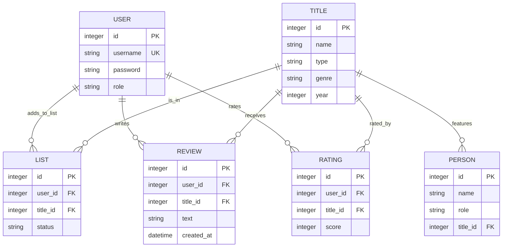

# Вариант 29 — ERD (диаграмма сущностей) — Кино/сериалы «Что посмотреть?»

Файл содержит: 1) mermaid-диаграмму ERD; 2) ASCII-эскиз; 3) SQLAlchemy модели; 4) примеры SQL для PostgreSQL

## Mermaid ERD



## ASCII-эскиз

``` User
User 1---* List *---1 Title 1---* Person
User 1---* Review *---1 Title
User 1---* Rating *---1 Title
```

## SQLAlchemy модели (Python, из models.py)

```python
from flask_sqlalchemy import SQLAlchemy
from datetime import datetime

db = SQLAlchemy()

class User(db.Model):
    id = db.Column(db.Integer, primary_key=True)
    username = db.Column(db.String(80), unique=True, nullable=False)
    password = db.Column(db.String(255), nullable=False)
    role = db.Column(db.String(20), default='user')  # user/admin

class Title(db.Model):
    id = db.Column(db.Integer, primary_key=True)
    name = db.Column(db.String(255), nullable=False)
    type = db.Column(db.String(20))  # movie/series
    genre = db.Column(db.String(100))
    year = db.Column(db.Integer)
    persons = db.relationship('Person', backref='title', lazy=True)

class Person(db.Model):
    id = db.Column(db.Integer, primary_key=True)
    name = db.Column(db.String(255), nullable=False)
    role = db.Column(db.String(50))  # actor/director
    title_id = db.Column(db.Integer, db.ForeignKey('title.id'), nullable=False)

class List(db.Model):
    id = db.Column(db.Integer, primary_key=True)
    user_id = db.Column(db.Integer, db.ForeignKey('user.id'), nullable=False)
    title_id = db.Column(db.Integer, db.ForeignKey('title.id'), nullable=False)
    status = db.Column(db.String(20))  # watching/planned/completed/dropped

class Review(db.Model):
    id = db.Column(db.Integer, primary_key=True)
    user_id = db.Column(db.Integer, db.ForeignKey('user.id'), nullable=False)
    title_id = db.Column(db.Integer, db.ForeignKey('title.id'), nullable=False)
    text = db.Column(db.Text, nullable=False)
    created_at = db.Column(db.DateTime, default=datetime.utcnow)

class Rating(db.Model):
    id = db.Column(db.Integer, primary_key=True)
    user_id = db.Column(db.Integer, db.ForeignKey('user.id'), nullable=False)
    title_id = db.Column(db.Integer, db.ForeignKey('title.id'), nullable=False)
    score = db.Column(db.Integer, nullable=False)  # 1-10
```

## SQL DDL (пример для PostgreSQL)

```sql
CREATE TABLE "user" (
    id SERIAL PRIMARY KEY,
    username VARCHAR(80) NOT NULL UNIQUE,
    password VARCHAR(255) NOT NULL,
    role VARCHAR(20) DEFAULT 'user' CHECK(role IN ('user','admin'))
);

CREATE TABLE title (
    id SERIAL PRIMARY KEY,
    name VARCHAR(255) NOT NULL,
    type VARCHAR(20) CHECK(type IN ('movie','series')),
    genre VARCHAR(100),
    year INTEGER
);

CREATE TABLE person (
    id SERIAL PRIMARY KEY,
    name VARCHAR(255) NOT NULL,
    role VARCHAR(50) CHECK(role IN ('actor','director')),
    title_id INTEGER NOT NULL REFERENCES title(id) ON DELETE CASCADE
);

CREATE TABLE list (
    id SERIAL PRIMARY KEY,
    user_id INTEGER NOT NULL REFERENCES "user"(id) ON DELETE CASCADE,
    title_id INTEGER NOT NULL REFERENCES title(id) ON DELETE CASCADE,
    status VARCHAR(20) CHECK(status IN ('watching','planned','completed','dropped')) DEFAULT 'planned',
    UNIQUE(user_id, title_id)
);

CREATE TABLE review (
    id SERIAL PRIMARY KEY,
    user_id INTEGER NOT NULL REFERENCES "user"(id) ON DELETE CASCADE,
    title_id INTEGER NOT NULL REFERENCES title(id) ON DELETE CASCADE,
    text TEXT NOT NULL,
    created_at TIMESTAMP DEFAULT CURRENT_TIMESTAMP,
    UNIQUE(user_id, title_id)
);

CREATE TABLE rating (
    id SERIAL PRIMARY KEY,
    user_id INTEGER NOT NULL REFERENCES "user"(id) ON DELETE CASCADE,
    title_id INTEGER NOT NULL REFERENCES title(id) ON DELETE CASCADE,
    score INTEGER NOT NULL CHECK(score >= 1 AND score <= 10),
    UNIQUE(user_id, title_id)
);
```
