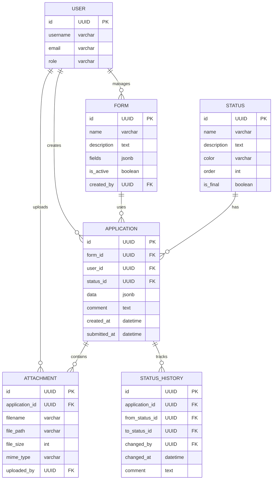

# Вариант 40 — Ключевые сущности, связи и API (эскиз)

Сущности (основные)

- User
  - id: UUID
  - username: string (unique)
  - email: string (unique)
  - password_hash: string
  - role: enum [admin, moderator, user]
  - created_at: datetime

- Form
  - id: UUID
  - name: string
  - description: string
  - fields: JSON (схема полей формы)
  - is_active: boolean
  - created_by: reference -> User.id
  - created_at: datetime
  - updated_at: datetime

- Status
  - id: UUID
  - name: string (unique)
  - description: string
  - color: string (для UI, например #FF5733)
  - order: integer (порядок в жизненном цикле)
  - is_final: boolean (финальный статус)
  - created_at: datetime

- Application
  - id: UUID
  - form_id: reference -> Form.id
  - user_id: reference -> User.id
  - status_id: reference -> Status.id
  - data: JSON (заполненные поля формы)
  - comment: string (комментарий модератора)
  - created_at: datetime
  - updated_at: datetime
  - submitted_at: datetime (когда отправлена)

- Attachment
  - id: UUID
  - application_id: reference -> Application.id
  - filename: string
  - file_path: string
  - file_size: integer
  - mime_type: string
  - uploaded_by: reference -> User.id
  - uploaded_at: datetime

- StatusHistory
  - id: UUID
  - application_id: reference -> Application.id
  - from_status_id: reference -> Status.id (nullable, null при создании)
  - to_status_id: reference -> Status.id
  - changed_by: reference -> User.id
  - changed_at: datetime
  - comment: string (опционально)

Связи (ER-эскиз)

- User 1..* Application (пользователь создаёт заявки)
- User 1..* Form (администратор создаёт формы)
- Form 1..* Application (по форме создаются заявки)
- Status 1..* Application (статус применяется к заявкам)
- Application 1..* Attachment (заявка имеет вложения)
- Application 1..* StatusHistory (заявка имеет историю статусов)

Обязательные поля и ограничения (кратко)

- unique(User.username)
- unique(User.email)
- unique(Status.name)
- Application.form_id → Form.id (FK, not null)
- Application.user_id → User.id (FK, not null)
- Application.status_id → Status.id (FK, not null)
- Attachment.application_id → Application.id (FK, not null)
- Attachment.uploaded_by → User.id (FK, not null)
- Form.created_by → User.id (FK, not null)
- StatusHistory.application_id → Application.id (FK, not null)
- StatusHistory.to_status_id → Status.id (FK, not null)
- StatusHistory.changed_by → User.id (FK, not null)

API — верхнеуровневые ресурсы и операции

- /users
  - GET /users (admin)
  - POST /users (admin)
  - GET /users/{id}
  - PUT /users/{id}
  - DELETE /users/{id}

- /forms
  - GET /forms (list, filter by is_active)
  - POST /forms (admin)
  - GET /forms/{id}
  - PUT /forms/{id} (admin)
  - DELETE /forms/{id} (admin)

- /statuses
  - GET /statuses (list all statuses)
  - POST /statuses (admin)
  - GET /statuses/{id}
  - PUT /statuses/{id} (admin)
  - DELETE /statuses/{id} (admin)

- /applications
  - GET /applications (list, filter by user/status/form)
  - POST /applications (create new application)
  - GET /applications/{id}
  - PUT /applications/{id} (update draft)
  - DELETE /applications/{id}
  - POST /applications/{id}/submit (submit for review)
  - PUT /applications/{id}/status (change status, moderator/admin)

- /attachments
  - GET /attachments?application_id= (list attachments for application)
  - POST /attachments (upload file)
  - GET /attachments/{id} (download file)
  - DELETE /attachments/{id}

Дополнительно (бонусы)

- Многоэтапное согласование (workflow с несколькими статусами)
- Документация API (OpenAPI/Swagger)
- Тесты: unit + интеграционные для трекинга статусов
- Kubernetes deployment
- CI/CD pipeline

---

## Подробные операции API, схемы и поведение

Общие принципы

- Ответы в формате: `{ "status": "ok" | "error", "data"?: ..., "error"?: {code, message, fields?} }`
- Пагинация: `limit` и `offset` (по умолчанию limit=50).
- Аутентификация: `Authorization: Bearer <jwt>`; роли: `admin`, `moderator`, `user`.

Примеры ошибок (JSON)

```json
{
  "status": "error",
  "error": { "code": "validation_failed", "message": "Validation failed", "fields": { "name": "required" } }
}
```

Auth

- POST `/auth/register` — `{email, password, username}` → `201 {id, email, username, role}`
- POST `/auth/login` — `{email, password}` → `200 {accessToken, refreshToken, user}`
- POST `/auth/refresh` — `{refreshToken}` → `200 {accessToken}`

Users

- GET `/users?limit=&offset=` — Admin
- GET `/users/{id}` — Admin или self
- POST `/users` — Admin (payload: `{username,email,password,role?}`)
- PUT `/users/{id}` — Admin или self (частичное обновление)
- DELETE `/users/{id}` — Admin

Forms

- GET `/forms?is_active=&limit=&offset=` — список форм
- POST `/forms` — Admin (payload: `{name,description,fields,is_active?}`)
- GET `/forms/{id}` — детали формы, включая схему полей
- PUT `/forms/{id}` — Admin
- DELETE `/forms/{id}` — Admin

Statuses

- GET `/statuses?limit=&offset=` — список статусов
- POST `/statuses` — Admin (payload: `{name,description,color,order,is_final?}`)
- GET `/statuses/{id}` — детали статуса
- PUT `/statuses/{id}` — Admin
- DELETE `/statuses/{id}` — Admin

Applications

- GET `/applications?userId=&formId=&statusId=&limit=&offset=` — список заявок

  - User видит только свои, Moderator/Admin видят все

- POST `/applications` — создать заявку

  - Payload:

  ```json
  {
    "formId": "uuid",
    "data": { "field1": "value1", "field2": "value2" }
  }
  ```

  - Response: `201 {id, status: "draft"}`

- GET `/applications/{id}` — детали заявки

  - Response включает: id, form, user, status, data, attachments, history

- PUT `/applications/{id}` — редактирование (только draft)

  - Payload: `{data: {...}}`

- DELETE `/applications/{id}` — удаление (только draft, владелец или admin)

- POST `/applications/{id}/submit` — отправить на рассмотрение

  - Меняет статус с draft на pending
  - Response: `200 {id, status: "pending"}`

- PUT `/applications/{id}/status` — изменить статус (Moderator/Admin)

  - Payload:

  ```json
  {
    "statusId": "uuid",
    "comment": "Причина изменения статуса"
  }
  ```

  - Response: `200 {id, status, comment}`

- POST `/applications/{id}/withdraw` — отозвать заявку (владелец)

  - Условие: заявка не в финальном статусе (is_final = false)
  - Меняет статус на `withdrawn`
  - Response: `200 {id, status: "withdrawn"}`
  - Ошибка 403: если заявка уже в финальном статусе

Attachments

- GET `/attachments?applicationId=` — список вложений заявки

  - Авторизация: владелец заявки, Moderator или Admin

- POST `/attachments` — загрузка файла

  - Content-Type: multipart/form-data
  - Fields: applicationId, file
  - Авторизация: только владелец заявки (заявка в статусе draft)
  - Ограничения: max 10 файлов на заявку, max 10 МБ на файл, общий размер до 50 МБ
  - Response: `201 {id, filename, fileSize, mimeType}`
  - Ошибка 400: превышен лимит файлов или размера

- GET `/attachments/{id}` — скачивание файла

  - Авторизация: владелец заявки, Moderator или Admin
  - Response: binary file
  - Ошибка 403: нет доступа к вложению

- DELETE `/attachments/{id}` — удаление вложения

  - Авторизация: владелец заявки (заявка в статусе draft) или Admin
  - Ошибка 403: нет прав на удаление

History (аудит изменений статуса)

- GET `/applications/{id}/history` — история изменений статуса

  - Response:

  ```json
  [
    {
      "id": "uuid",
      "fromStatus": "draft",
      "toStatus": "pending",
      "changedBy": "user-id",
      "changedAt": "2025-01-15T10:00:00Z",
      "comment": null
    }
  ]
  ```

---

## ERD (диаграмма сущностей)

Mermaid-диаграмма (если рендер поддерживается):



ASCII-эскиз (если mermaid не рендерится):

```text
User 1---* Application *---1 Form
      \        |
       \       *---1 Status
        \      |
         \     *---* Attachment
          \    |
           \   *---* StatusHistory
            \
             *---* Form (admin creates forms)
```

---

AC — критерии приёмки для функционала Status Tracking (MVP)

- AC1: При создании Application присваивается статус `draft`, при submit — статус меняется на `pending`.
- AC2: При изменении статуса создаётся запись в `status_history` с указанием предыдущего и нового статуса, пользователя и времени.
- AC3: GET `/applications/{id}` возвращает полную историю изменений статуса для отслеживания пользователем.
- AC4: Пользователь видит только свои заявки, Модератор и Администратор видят все заявки.
