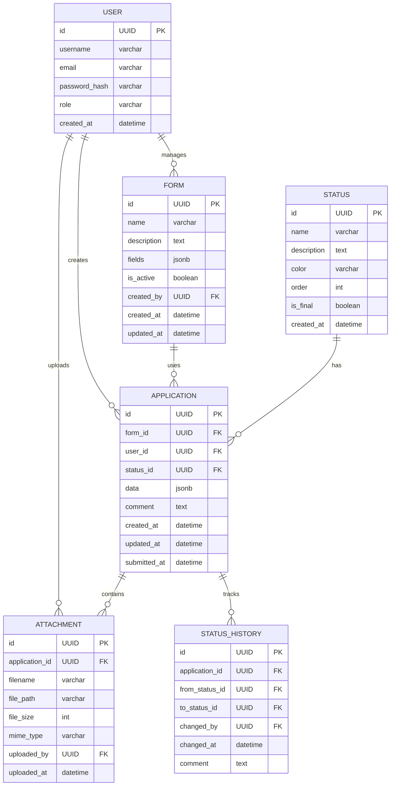

# Вариант 40 — ERD (диаграмма сущностей) — Заявки «Да, я в деле»

Файл содержит: 1) mermaid-диаграмму ERD; 2) ASCII-эскиз; 3) минимальный SQL DDL-скетч для создания таблиц.

## Mermaid ERD



## ASCII-эскиз

```
User 1---* Application *---1 Form
      \        |
       \       *---1 Status
        \      |
         \     *---* Attachment
          \    |
           \   *---* Status_History
            \
             *---* Form (admin creates forms)
```

## Минимальный SQL DDL (пример, PostgreSQL)

```sql
CREATE TABLE users (
    id UUID PRIMARY KEY DEFAULT gen_random_uuid(),
    username TEXT UNIQUE NOT NULL,
    email TEXT UNIQUE NOT NULL,
    password_hash TEXT NOT NULL,
    role TEXT NOT NULL CHECK (role IN ('admin', 'moderator', 'user')),
    created_at TIMESTAMP WITH TIME ZONE DEFAULT now()
);

CREATE TABLE statuses (
    id UUID PRIMARY KEY DEFAULT gen_random_uuid(),
    name TEXT UNIQUE NOT NULL,
    description TEXT,
    color TEXT DEFAULT '#808080',
    "order" INTEGER NOT NULL DEFAULT 0,
    is_final BOOLEAN DEFAULT FALSE,
    created_at TIMESTAMP WITH TIME ZONE DEFAULT now()
);

CREATE TABLE forms (
    id UUID PRIMARY KEY DEFAULT gen_random_uuid(),
    name TEXT NOT NULL,
    description TEXT,
    fields JSONB NOT NULL DEFAULT '[]',
    is_active BOOLEAN DEFAULT TRUE,
    created_by UUID NOT NULL REFERENCES users(id) ON DELETE RESTRICT,
    created_at TIMESTAMP WITH TIME ZONE DEFAULT now(),
    updated_at TIMESTAMP WITH TIME ZONE DEFAULT now()
);

CREATE TABLE applications (
    id UUID PRIMARY KEY DEFAULT gen_random_uuid(),
    form_id UUID NOT NULL REFERENCES forms(id) ON DELETE RESTRICT,
    user_id UUID NOT NULL REFERENCES users(id) ON DELETE CASCADE,
    status_id UUID NOT NULL REFERENCES statuses(id) ON DELETE RESTRICT,
    data JSONB NOT NULL DEFAULT '{}',
    comment TEXT,
    created_at TIMESTAMP WITH TIME ZONE DEFAULT now(),
    updated_at TIMESTAMP WITH TIME ZONE DEFAULT now(),
    submitted_at TIMESTAMP WITH TIME ZONE
);

CREATE TABLE attachments (
    id UUID PRIMARY KEY DEFAULT gen_random_uuid(),
    application_id UUID NOT NULL REFERENCES applications(id) ON DELETE CASCADE,
    filename TEXT NOT NULL,
    file_path TEXT NOT NULL,
    file_size INTEGER NOT NULL,
    mime_type TEXT NOT NULL,
    uploaded_by UUID NOT NULL REFERENCES users(id) ON DELETE RESTRICT,
    uploaded_at TIMESTAMP WITH TIME ZONE DEFAULT now()
);

CREATE TABLE status_history (
    id UUID PRIMARY KEY DEFAULT gen_random_uuid(),
    application_id UUID NOT NULL REFERENCES applications(id) ON DELETE CASCADE,
    from_status_id UUID REFERENCES statuses(id),
    to_status_id UUID NOT NULL REFERENCES statuses(id),
    changed_by UUID NOT NULL REFERENCES users(id) ON DELETE RESTRICT,
    changed_at TIMESTAMP WITH TIME ZONE DEFAULT now(),
    comment TEXT
);

-- Индексы для производительности
CREATE INDEX idx_applications_user_id ON applications(user_id);
CREATE INDEX idx_applications_status_id ON applications(status_id);
CREATE INDEX idx_applications_form_id ON applications(form_id);
CREATE INDEX idx_attachments_application_id ON attachments(application_id);
CREATE INDEX idx_status_history_application_id ON status_history(application_id);

-- Предустановленные статусы
INSERT INTO statuses (name, description, color, "order", is_final) VALUES
    ('draft', 'Черновик', '#9E9E9E', 0, FALSE),
    ('pending', 'На рассмотрении', '#FFC107', 1, FALSE),
    ('in_review', 'Рассматривается', '#2196F3', 2, FALSE),
    ('approved', 'Одобрена', '#4CAF50', 3, TRUE),
    ('rejected', 'Отклонена', '#F44336', 4, TRUE),
    ('needs_revision', 'Требует доработки', '#FF9800', 5, FALSE);
```
