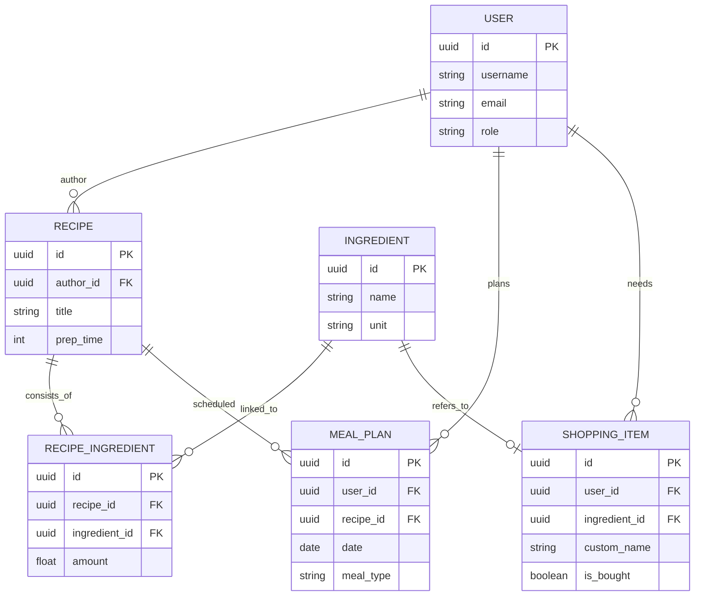

# Вариант 18 — Ключевые сущности, связи и API (эскиз)

Сущности (основные)

- User
  - id: UUID
  - username: string (unique)
  - email: string (unique)
  - password_hash: string
  - role: enum [admin, user]
  - preferences: json (аллергены, диеты)

- Ingredient (Справочник)
  - id: UUID
  - name: string (unique)
  - unit: string (базовая: г, мл, шт)
  - calories: float (ккал/100ед)
  - is_allergen: boolean

- Recipe
  - id: UUID
  - author_id: reference -> User.id
  - title: string
  - description: string
  - instructions: text
  - prep_time: integer (минуты)
  - servings: integer

- RecipeIngredient (Состав рецепта)
  - id: UUID
  - recipe_id: reference -> Recipe.id
  - ingredient_id: reference -> Ingredient.id
  - amount: float
  - unit: string (локальная: ст.л., стакан и т.д.)

- MealPlan
  - id: UUID
  - user_id: reference -> User.id
  - recipe_id: reference -> Recipe.id
  - date: date
  - meal_type: enum [breakfast, lunch, dinner, snack]

- ShoppingItem
  - id: UUID
  - user_id: reference -> User.id
  - ingredient_id: reference -> Ingredient.id (nullable)
  - custom_name: string (если нет ingredient_id)
  - amount: float
  - is_bought: boolean

Связи (ER-эскиз)

- User 1..* Recipe (пользователь создает рецепты)
- Recipe 1..* RecipeIngredient (рецепт состоит из ингредиентов)
- Ingredient 1..* RecipeIngredient (ингредиент используется в рецептах)
- User 1..* MealPlan (пользователь планирует меню)
- MealPlan 1..1 Recipe (пункт плана ссылается на рецепт)
- User 1..* ShoppingItem (пользователь ведет список покупок)

Обязательные поля и ограничения (кратко)

- unique(User.email), unique(User.username)
- unique(Ingredient.name)
- Recipe.author_id → User.id (FK, not null)
- MealPlan.user_id → User.id (FK, not null)
- ShoppingItem.user_id → User.id (FK, not null)
- Проверка: `amount > 0` для ингредиентов и покупок.

API — верхнеуровневые ресурсы и операции

- /auth
  - POST /auth/register
  - POST /auth/login

- /users
  - GET /users/me (profile)
  - PUT /users/me (preferences)

- /ingredients
  - GET /ingredients (autocomplete search)
  - POST /ingredients (admin only)

- /recipes
  - GET /recipes (search, filters: ingredients, tags)
  - POST /recipes (create)
  - GET /recipes/{id}
  - PUT /recipes/{id} (author only)
  - DELETE /recipes/{id} (author/admin)

- /mealplan
  - GET /mealplan (by date range)
  - POST /mealplan (add entry)
  - DELETE /mealplan/{id}

- /shopping
  - GET /shopping
  - POST /shopping/generate (from meal plan)
  - POST /shopping (add manual item)
  - PUT /shopping/{id} (toggle status)
  - DELETE /shopping/{id}

Дополнительно (бонусы)

- POST /recipes/import — импорт по URL
- GET /recipes/recommendations — умный подбор
- Документация API (OpenAPI/Swagger)
- Тесты: unit для агрегации списка покупок

---

## Подробные операции API, схемы и поведение

Общие принципы

- Ответы в формате: `{ "status": "ok" | "error", "data"?: ..., "error"?: {code, message, fields?} }`
- Пагинация: `limit` и `offset` (по умолчанию limit=20).
- Аутентификация: `Authorization: Bearer <jwt>`.

Примеры ошибок (JSON)

```json
{
  "status": "error",
  "error": { "code": "resource_not_found", "message": "Recipe not found" }
}
```

Auth

- POST `/auth/register` — `{email, password, name}` → `201 {id, role}`
- POST `/auth/login` — `{email, password}` → `200 {accessToken, user: {id, username, role}}`

Ingredients (Справочники)

- GET `/ingredients?query=pot` — поиск для автокомплита
- POST `/ingredients` — Admin (payload: `{name, unit, calories, isAllergen}` → `201 {id}`)

Recipes (Основной контент)

- GET `/recipes?ingredients=uuid1,uuid2&tags=vegan&limit=&offset=` — Логика: поиск рецептов, содержащих перечисленные ингредиенты ("Что в холодильнике").
- POST `/recipes` — создание рецепта
  - Payload (пример):

  ```json
   {
  "title": "Омлет с сыром",
  "description": "Быстрый завтрак",
  "instructions": "1. Разбить яйца...\n2. Добавить сыр...",
  "prepTime": 10,
  "servings": 2,
  "ingredients": [
    { "ingredientId": "uuid-egg", "amount": 2, "unit": "шт" },
    { "ingredientId": "uuid-cheese", "amount": 50, "unit": "г" }
  ],
  "tags": ["uuid-breakfast", "uuid-keto"]
    }
  ```

- GET `/recipes/{id}` — полная информация с вложенными ингредиентами и автором.

MealPlan (Календарь)

- GET `/mealplan?from=2023-10-01&to=2023-10-07` — получить план на неделю
- POST `/mealplan`
  - Payload (пример):

  ```json
   {
  "date": "2023-10-05",
  "mealType": "dinner",
  "recipeId": "uuid-omlet"
    }
  ```

  Валидация: проверка корректности даты и существования рецепта.

Shopping List (Список покупок)

- GET `/shopping` — текущий список (сгруппированный)
- POST `/shopping` — добавить произвольный товар.
  - Payload (пример):

  ```json
   {
  "customName": "Губки для посуды",
  "amount": 1
    }
  ```

- POST `/shopping/generate` — Генерация из плана питания.
  - Payload (пример):

  ```json
   {
  "fromDate": "2023-10-01",
  "toDate": "2023-10-07"
    }
  ```

  Логика:
  - Найти все MealPlan записи за период.
  - Извлечь ингредиенты из связанных рецептов.
  - Агрегировать (суммировать) `amount` для одинаковых `ingredientId`.
  - Создать записи в ShoppingItem.
  - Ответ: `200 { "itemsAdded": 15 }`.
- PUT `/shopping/{id}/toggle` — инвертировать is_bought.
- DELETE `/shopping/clear-bought` — удалить все купленные товары.

---

## ERD (диаграмма сущностей)

Mermaid-диаграмма (если рендер поддерживается):



ASCII-эскиз (если mermaid не рендерится):

```text
User 1---* Recipe 1---* RecipeIngredient *---1 Ingredient
  |         |                                     |
  * * |
MealPlan *--/                                     |
  |                                               |
  * *
ShoppingItem *------------------------------------/
(User owns ShoppingList, Items refer to Ingredient)
```

---

AC — критерии приёмки для функционала Alerts (MVP)

- AC1: При вызове `/shopping/generate` система должна найти все рецепты в плане пользователя на указанные даты и корректно просуммировать количество одинаковых ингредиентов (например, 2 яйца утром + 3 яйца вечером = 5 яиц в списке).
- AC2: Пользователь может вручную добавить товар, не связанный с рецептом (customName), и он сохраняется в том же списке.
- AC3: Товары имеют состояние `is_bought` (куплено/не куплено), которое переключается отдельным эндпоинтом, купленные товары визуально отличаются, но не удаляются сразу.
