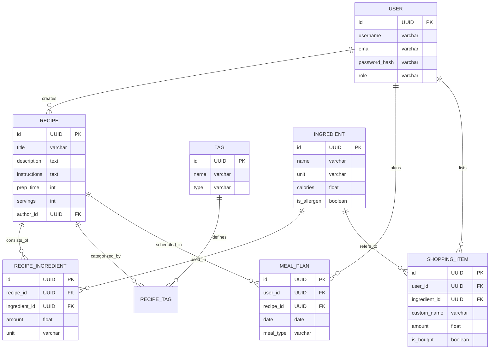

# Вариант 18 — ERD (диаграмма сущностей) — Рецепты

Файл содержит: 1) mermaid-диаграмму ERD; 2) ASCII-эскиз; 3) минимальный SQL DDL-скетч для создания таблиц.

## Mermaid ERD



## ASCII-эскиз

User
     /  |  \
    /   |   \
Recipe  |  ShoppingItem --- (opt) Ingredient
  |     |                       |
  |   MealPlan                  |
  |                             |
  +--- RecipeIngredient --------+
  |
  +--- Tag

## Минимальный SQL DDL (пример, PostgreSQL)

```sql
CREATE TABLE users (
    id UUID PRIMARY KEY DEFAULT gen_random_uuid(),
    username TEXT UNIQUE NOT NULL,
    email TEXT UNIQUE NOT NULL,
    password_hash TEXT NOT NULL,
    preferences JSONB DEFAULT '{}', -- хранение настроек аллергенов
    role TEXT NOT NULL DEFAULT 'user' CHECK (role IN ('admin', 'user')),
    created_at TIMESTAMP WITH TIME ZONE DEFAULT now()
);

CREATE TABLE ingredients (
    id UUID PRIMARY KEY DEFAULT gen_random_uuid(),
    name TEXT UNIQUE NOT NULL,
    unit TEXT NOT NULL, -- базовая единица (гр, мл, шт)
    calories FLOAT DEFAULT 0, -- ккал на 100 единиц
    is_allergen BOOLEAN DEFAULT FALSE
);

CREATE TABLE tags (
    id UUID PRIMARY KEY DEFAULT gen_random_uuid(),
    name TEXT UNIQUE NOT NULL,
    type TEXT NOT NULL CHECK (type IN ('diet', 'meal_type', 'feature'))
);

CREATE TABLE recipes (
    id UUID PRIMARY KEY DEFAULT gen_random_uuid(),
    title TEXT NOT NULL,
    description TEXT,
    instructions TEXT NOT NULL,
    prep_time INTEGER CHECK (prep_time > 0),
    cook_time INTEGER CHECK (cook_time >= 0),
    servings INTEGER CHECK (servings > 0),
    author_id UUID NOT NULL REFERENCES users(id) ON DELETE CASCADE,
    created_at TIMESTAMP WITH TIME ZONE DEFAULT now()
);

CREATE TABLE recipe_ingredients (
    id UUID PRIMARY KEY DEFAULT gen_random_uuid(),
    recipe_id UUID NOT NULL REFERENCES recipes(id) ON DELETE CASCADE,
    ingredient_id UUID NOT NULL REFERENCES ingredients(id) ON DELETE RESTRICT,
    amount FLOAT NOT NULL CHECK (amount > 0),
    unit TEXT NOT NULL -- единица измерения в конкретном рецепте
);

CREATE TABLE recipe_tags (
    id UUID PRIMARY KEY DEFAULT gen_random_uuid(),
    recipe_id UUID NOT NULL REFERENCES recipes(id) ON DELETE CASCADE,
    tag_id UUID NOT NULL REFERENCES tags(id) ON DELETE CASCADE,
    UNIQUE(recipe_id, tag_id)
);

CREATE TABLE meal_plans (
    id UUID PRIMARY KEY DEFAULT gen_random_uuid(),
    user_id UUID NOT NULL REFERENCES users(id) ON DELETE CASCADE,
    recipe_id UUID NOT NULL REFERENCES recipes(id) ON DELETE CASCADE,
    date DATE NOT NULL,
    meal_type TEXT NOT NULL CHECK (meal_type IN ('breakfast', 'lunch', 'dinner', 'snack'))
);

CREATE TABLE shopping_items (
    id UUID PRIMARY KEY DEFAULT gen_random_uuid(),
    user_id UUID NOT NULL REFERENCES users(id) ON DELETE CASCADE,
    ingredient_id UUID REFERENCES ingredients(id) ON DELETE SET NULL, -- может быть NULL для кастомных товаров
    custom_name TEXT, -- заполняется, если ingredient_id IS NULL
    amount FLOAT NOT NULL DEFAULT 1,
    is_bought BOOLEAN DEFAULT FALSE,
    CHECK (ingredient_id IS NOT NULL OR custom_name IS NOT NULL)
);

-- Индексы для производительности
CREATE INDEX idx_recipes_author ON recipes(author_id);
CREATE INDEX idx_recipe_ingredients_recipe ON recipe_ingredients(recipe_id);
CREATE INDEX idx_meal_plans_user_date ON meal_plans(user_id, date);
CREATE INDEX idx_shopping_items_user ON shopping_items(user_id);

-- Примеры базовых данных (Seeds)
INSERT INTO tags (name, type) VALUES 
    ('Вегетарианское', 'diet'),
    ('Завтрак', 'meal_type'),
    ('Острое', 'feature');
```
