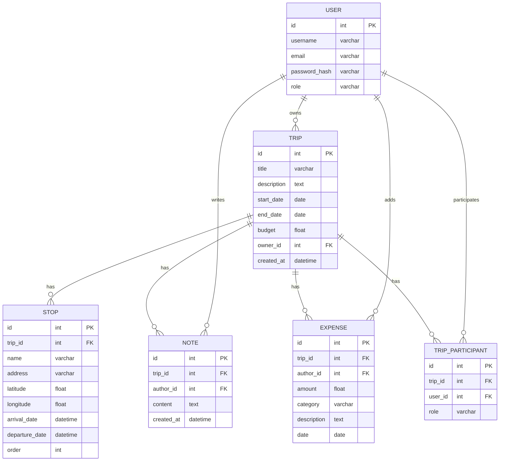

# Вариант 35 — ERD (диаграмма сущностей) — Поездки «Поехали!»

Файл содержит: 1) mermaid-диаграмму ERD; 2) ASCII-эскиз; 3) минимальный SQL DDL-скетч для создания таблиц.

## Mermaid ERD



## ASCII-эскиз

```text
User 1---* Trip 1---* Stop
     \           \
      \           \-* Note
       \          \-* Expense
        \
         \-*- TripParticipant (User many-to-many Trip)
```

## Минимальный SQL DDL (пример, PostgreSQL)

```sql
CREATE TABLE users (
    id UUID PRIMARY KEY,
    username TEXT UNIQUE NOT NULL,
    email TEXT UNIQUE NOT NULL,
    password_hash TEXT NOT NULL,
    role TEXT NOT NULL CHECK (role IN ('admin','user'))
);

CREATE TABLE trips (
    id UUID PRIMARY KEY,
    title TEXT NOT NULL,
    description TEXT,
    start_date DATE,
    end_date DATE,
    budget DOUBLE PRECISION,
    owner_id UUID NOT NULL REFERENCES users(id) ON DELETE CASCADE,
    created_at TIMESTAMP WITH TIME ZONE DEFAULT now()
);

CREATE TABLE stops (
    id UUID PRIMARY KEY,
    trip_id UUID NOT NULL REFERENCES trips(id) ON DELETE CASCADE,
    name TEXT NOT NULL,
    address TEXT,
    latitude DOUBLE PRECISION,
    longitude DOUBLE PRECISION,
    arrival_date TIMESTAMP WITH TIME ZONE,
    departure_date TIMESTAMP WITH TIME ZONE,
    "order" INTEGER NOT NULL
);

CREATE TABLE notes (
    id UUID PRIMARY KEY,
    trip_id UUID NOT NULL REFERENCES trips(id) ON DELETE CASCADE,
    author_id UUID NOT NULL REFERENCES users(id) ON DELETE CASCADE,
    content TEXT NOT NULL,
    created_at TIMESTAMP WITH TIME ZONE DEFAULT now()
);

CREATE TABLE expenses (
    id UUID PRIMARY KEY,
    trip_id UUID NOT NULL REFERENCES trips(id) ON DELETE CASCADE,
    author_id UUID NOT NULL REFERENCES users(id) ON DELETE CASCADE,
    amount DOUBLE PRECISION NOT NULL,
    category TEXT,
    description TEXT,
    date DATE NOT NULL
);

CREATE TABLE trip_participants (
    id UUID PRIMARY KEY,
    trip_id UUID NOT NULL REFERENCES trips(id) ON DELETE CASCADE,
    user_id UUID NOT NULL REFERENCES users(id) ON DELETE CASCADE,
    role TEXT NOT NULL CHECK (role IN ('owner','participant')),
    UNIQUE(trip_id, user_id)
);
```
