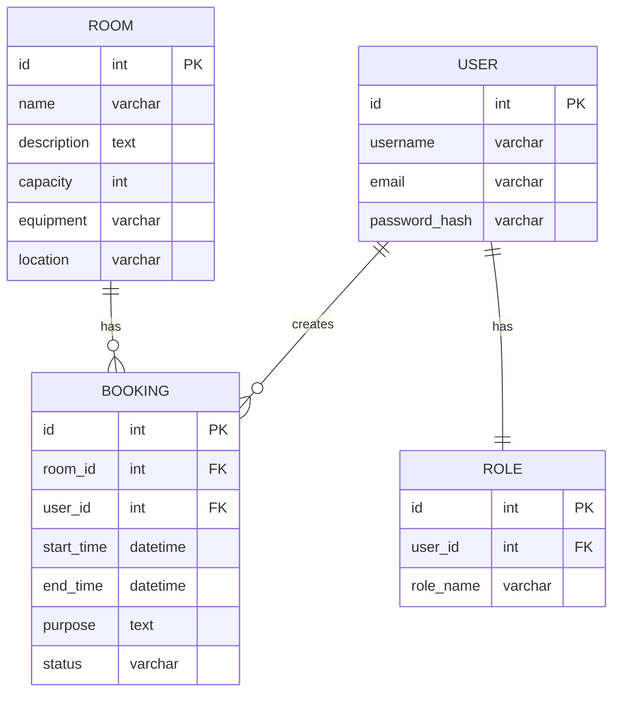

# Вариант 02 — Ключевые сущности, связи и API (эскиз)

Сущности (основные)

- User
  - id: UUID
  - username: string (unique)
  - email: string (unique)
  - password_hash: string
  - role: enum [admin, teacher, student]
  - created_at: datetime
  - updated_at: datetime

- Room
  - id: UUID
  - name: string (unique)
  - description: string
  - capacity: number
  - equipment: string
  - location: string
  - created_at: datetime
  - updated_at: datetime

- Booking
  - id: UUID
  - room_id: reference -> Room.id
  - user_id: reference -> User.id
  - start_time: datetime
  - end_time: datetime
  - purpose: string (max 500)
  - status: enum [active, cancelled]
  - created_at: datetime
  - updated_at: datetime

- RefreshToken
  - id: UUID
  - user_id: reference -> User.id
  - token: string (unique)
  - expires_at: datetime
  - created_at: datetime

- AuditLog
  - id: UUID
  - entity_type: enum [user, room, booking]
  - entity_id: UUID
  - action: enum [created, updated, cancelled, deleted]
  - user_id: reference -> User.id
  - changes: JSON
  - reason: string (optional)
  - created_at: datetime

Связи (ER-эскиз)

- User 1..* Booking (пользователь создаёт бронирования)
- Room 1..* Booking (аудитория имеет бронирования)
- User 1..* RefreshToken (пользователь имеет refresh tokens)
- User 1..* AuditLog (пользователь выполняет действия)

Обязательные поля и ограничения (кратко)

- unique(User.username)
- unique(User.email)
- unique(Room.name)
- unique(RefreshToken.token)
- Booking.room_id → Room.id (FK, not null)
- Booking.user_id → User.id (FK, not null)
- Booking.start_time < Booking.end_time
- Booking: CHECK (EXTRACT(EPOCH FROM (end_time - start_time)) / 3600 <= 4) -- макс. 4 часа
- RefreshToken.user_id → User.id (FK, not null, ON DELETE CASCADE)
- AuditLog.user_id → User.id (FK, not null)
- Index: bookings(room_id, start_time, end_time, status) для проверки конфликтов

API — верхнеуровневые ресурсы и операции

**Формат спецификации**: Method Path (Required Role) - Description

- /users
  - GET /users (admin) - список всех пользователей
  - POST /users (admin) - создание пользователя
  - GET /users/{id} (admin | self) - получение пользователя
  - PUT /users/{id} (admin | self) - обновление пользователя
  - DELETE /users/{id} (admin) - удаление пользователя

- /rooms
  - GET /rooms (any) - список аудиторий с фильтрацией
  - POST /rooms (admin) - создание аудитории
  - GET /rooms/{id} (any) - получение аудитории
  - PUT /rooms/{id} (admin) - обновление аудитории
  - DELETE /rooms/{id} (admin) - удаление аудитории

- /bookings
  - GET /bookings (any) - список бронирований с фильтрацией
  - POST /bookings (authenticated) - создание с проверкой конфликтов и лимитов
  - GET /bookings/{id} (any) - получение бронирования
  - PUT /bookings/{id} (owner | admin) - перенос бронирования
  - DELETE /bookings/{id} (owner | admin) - отмена бронирования

- /schedule
  - GET /schedule?roomId=&date=&from=&to= (any) - просмотр расписания
  - GET /schedule/conflicts?roomId=&start=&end= (any) - проверка конфликтов

Дополнительно (бонусы — НЕ обязательны для MVP)

- **[BONUS]** GET /bookings/{id}/export/ical — экспорт в iCal формат
- **[BONUS]** POST /bookings/bulk — массовое создание бронирований
- **[BONUS]** WebSocket /ws/bookings — уведомления о новых/изменённых бронированиях
- **[RECOMMENDED]** Документация API (OpenAPI/Swagger)
- **[RECOMMENDED]** Тесты: unit + интеграционные для логики конфликтов

**Обязательные требования безопасности (MVP)**:

- Helmet.js для HTTP заголовков безопасности
- CORS с явным списком разрешённых origins
- Rate limiting: 100 req/min для общих endpoints, 5 req/min для auth
- Валидация всех входных данных (Zod)
- Bcrypt для хеширования паролей (cost factor: 12)
- JWT: accessToken (15 min), refreshToken (7 days)
- Логирование всех критических операций (audit_log)

---

## Подробные операции API, схемы и поведение

Общие принципы

- Ответы в формате: `{ "status": "ok" | "error", "data"?: ..., "error"?: {code, message, fields?} }`
- Пагинация: `limit` и `offset` (по умолчанию limit=50).
- Аутентификация: `Authorization: Bearer <jwt>`; роли: `admin`, `teacher`, `student`.

Примеры ошибок (JSON)

```json
{
  "status": "error",
  "error": { "code": "validation_failed", "message": "Validation failed", "fields": { "room_id": "required" } }
}
```

Auth

- POST `/auth/register` — регистрация нового пользователя
  - Body: `{email, password, username, role?}` (role по умолчанию: 'student')
  - Validation: email (unique, valid format), password (min 8 chars), username (unique, 3-50 chars)
  - Response: `201 {id, email, username, role, createdAt}`
  - Errors: 400 (validation), 409 (email/username exists)

- POST `/auth/login` — вход в систему
  - Body: `{email, password}`
  - Response: `200 {accessToken, refreshToken, user: {id, email, username, role}}`
  - Security: JWT accessToken (expires 15m), refreshToken (expires 7d, сохраняется в БД)
  - Errors: 401 (invalid credentials), 429 (rate limit: 5 requests/min)

- POST `/auth/refresh` — обновление токена
  - Body: `{refreshToken}`
  - Validation: token существует в БД и не истёк
  - Response: `200 {accessToken}`
  - Errors: 401 (invalid/expired token)

- POST `/auth/logout` — выход из системы
  - Body: `{refreshToken}`
  - Action: удаление refreshToken из БД
  - Response: `204 No Content`

Users

- GET `/users?limit=&offset=` — Admin
- GET `/users/{id}` — Admin или self
- POST `/users` — Admin (payload: `{username,email,password,role?}`)
- PUT `/users/{id}` — Admin или self (частичное обновление)
- DELETE `/users/{id}` — Admin

Rooms

- GET `/rooms?capacity=&equipment=&location=&limit=&offset=` — список
- POST `/rooms` — Admin (payload: `{name,description,capacity,equipment,location}`)
- GET `/rooms/{id}` — детали аудитории
- PUT `/rooms/{id}` — Admin
- DELETE `/rooms/{id}` — Admin

Bookings (создание и управление)

- POST `/bookings` — создание бронирования
  - Auth: Bearer JWT (required)
  - Payload (пример):

  ```json
  {
    "roomId": "room-uuid-1",
    "startTime": "2025-12-20T10:00:00Z",
    "endTime": "2025-12-20T12:00:00Z",
    "purpose": "Лекция по математике"
  }
  ```

  - **Валидация и проверки** (в порядке выполнения):
    1. Поля: roomId (UUID, exists), startTime/endTime (ISO 8601, startTime < endTime)
    2. Purpose: 1-500 символов, обязательно
    3. **Длительность по роли**:
       - student: макс. 2 часа → ошибка 403: "Студент может бронировать до 2 часов"
       - teacher: макс. 4 часа → ошибка 403: "Преподаватель может бронировать до 4 часов"
       - admin: без ограничений
    4. **Проверка конфликтов** (SQL):

       ```sql
       SELECT id, start_time, end_time, user_id
       FROM bookings
       WHERE room_id = $roomId
         AND status = 'active'
         AND NOT (end_time <= $startTime OR start_time >= $endTime)
       ```

       Если найдены → 409 Conflict с массивом занятых слотов
    5. Создание записи + запись в audit_log (action: 'created')
  - Response: `201 {id, roomId, userId, startTime, endTime, purpose, status, createdAt}`
  - Errors:
    - 400: validation failed
    - 403: duration limit exceeded
    - 404: room not found
    - 409: `{error: "conflict", message: "Room is already booked", conflicts: [{id, startTime, endTime, userId}]}`

- GET `/bookings?roomId=&userId=&date=&status=&limit=&offset=` — список бронирований
  - Auth: optional (без токена — только публичная информация)
  - Filters: roomId, userId, date (YYYY-MM-DD), status
  - Response: `200 {data: [...], total, limit, offset}`

- GET `/bookings/{id}` — детали бронирования
  - Auth: optional
  - Response: `200 {id, room: {id, name}, user: {id, username}, startTime, endTime, purpose, status, createdAt}`

- PUT `/bookings/{id}` — перенос бронирования
  - Auth: Bearer JWT (required)
  - Permission: userId === booking.userId OR role === 'admin'
  - Payload: `{startTime, endTime}` (оба обязательны)
  - Validation: те же проверки, что при создании (длительность, конфликты)
  - Action: обновление + запись в audit_log (action: 'updated', changes: {old, new})
  - Response: `200 {updated booking}`
  - Errors: 403 (no permission), 404 (not found), 409 (conflict)

- DELETE `/bookings/{id}` — отмена бронирования
  - Auth: Bearer JWT (required)
  - Permission: userId === booking.userId OR role === 'admin'
  - Body (если admin): `{reason: string}` — причина отмены (обязательно для admin)
  - Action: status → 'cancelled' + запись в audit_log (action: 'cancelled', reason)
  - Response: `204 No Content`
  - Errors: 403 (no permission), 404 (not found), 400 (reason required for admin)

Schedule и конфликты

- GET `/schedule?roomId=&date=&from=&to=` — расписание аудитории
  - Response: список бронирований с информацией о занятости

- GET `/schedule/conflicts?roomId=&startTime=&endTime=` — проверка конфликтов
  - Response: `{hasConflicts: boolean, conflicts: [{id, startTime, endTime, user}]}`

Export

- GET `/bookings/{id}/export/ical` — экспорт бронирования в формат iCalendar

Statistics (Admin/Teacher)

- GET `/statistics/rooms/{id}?from=&to=` — статистика использования аудитории
  - Auth: Bearer JWT (admin only)
  - Params: from/to (ISO 8601 dates, optional, default: last 30 days)
  - Response: `200 {roomId, roomName, period: {from, to}, totalBookings, totalHours, utilizationPercent, topUsers: [{userId, username, bookingsCount}]}`
  - Calculation: utilizationPercent = (totalHours / (period *24* 7)) * 100 (предполагаем работу 24/7)

- GET `/statistics/users/{id}?from=&to=` — статистика бронирований пользователя
  - Auth: Bearer JWT (admin OR self)
  - Response: `200 {userId, username, period: {from, to}, totalBookings, totalHours, favoriteRooms: [{roomId, roomName, bookingsCount}]}`

WebSocket (опционально)

- `ws://host/bookings?token=...` — события: `booking_created`, `booking_updated`, `booking_cancelled`.

---

## ERD (диаграмма сущностей)

Mermaid-диаграмма (если рендер поддерживается):



ASCII-эскиз (если mermaid не рендерится):

```text
User 1---* Booking *---1 Room
  |
  1
  |
Role
```

---

AC — критерии приёмки для функционала Booking (MVP)

- AC1: При создании Booking, система проверяет конфликты по room_id и времени; если конфликт есть, возвращает 409 с описанием.
- AC2: GET `/bookings?roomId=` возвращает все бронирования для указанной аудитории, отсортированные по времени.
- AC3: DELETE `/bookings/{id}` отменяет бронирование (устанавливает status='cancelled') и добавляет запись в audit log (кто и когда).
- AC4: Студент не может забронировать аудиторию более чем на 2 часа; преподаватель — до 4 часов.
