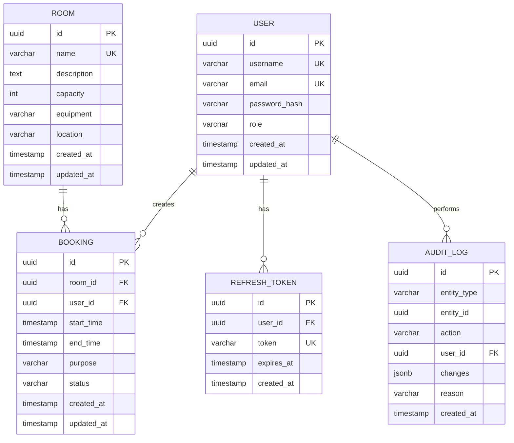

# Вариант 02 — ERD (диаграмма сущностей) — Бронь аудиторий «Не занято?»

Файл содержит: 1) mermaid-диаграмму ERD; 2) ASCII-эскиз; 3) минимальный SQL DDL-скетч для создания таблиц.

## Mermaid ERD



## ASCII-эскиз

```text
       User (role: enum)
         |
    +----+----+----+
    |    |    |    |
    1    1    1    1
    |    |    |    |
    *    *    *    *
Booking RefreshToken AuditLog
    |
    *
    |
    1
   Room
```

## Минимальный SQL DDL (пример, PostgreSQL)

```sql
-- Таблица пользователей
CREATE TABLE users (
 id UUID PRIMARY KEY DEFAULT gen_random_uuid(),
 username VARCHAR(50) UNIQUE NOT NULL,
 email VARCHAR(255) UNIQUE NOT NULL,
 password_hash VARCHAR(255) NOT NULL,
 role VARCHAR(20) NOT NULL CHECK (role IN ('admin','teacher','student')) DEFAULT 'student',
 created_at TIMESTAMP WITH TIME ZONE DEFAULT now(),
 updated_at TIMESTAMP WITH TIME ZONE DEFAULT now()
);

-- Таблица аудиторий
CREATE TABLE rooms (
 id UUID PRIMARY KEY DEFAULT gen_random_uuid(),
 name VARCHAR(100) UNIQUE NOT NULL,
 description TEXT,
 capacity INTEGER NOT NULL CHECK (capacity > 0),
 equipment TEXT,
 location VARCHAR(255) NOT NULL,
 created_at TIMESTAMP WITH TIME ZONE DEFAULT now(),
 updated_at TIMESTAMP WITH TIME ZONE DEFAULT now()
);

-- Таблица бронирований
CREATE TABLE bookings (
 id UUID PRIMARY KEY DEFAULT gen_random_uuid(),
 room_id UUID NOT NULL REFERENCES rooms(id) ON DELETE CASCADE,
 user_id UUID NOT NULL REFERENCES users(id) ON DELETE CASCADE,
 start_time TIMESTAMP WITH TIME ZONE NOT NULL,
 end_time TIMESTAMP WITH TIME ZONE NOT NULL,
 purpose VARCHAR(500) NOT NULL,
 status VARCHAR(20) NOT NULL CHECK (status IN ('active','cancelled')) DEFAULT 'active',
 created_at TIMESTAMP WITH TIME ZONE DEFAULT now(),
 updated_at TIMESTAMP WITH TIME ZONE DEFAULT now(),
 CHECK (start_time < end_time),
 CHECK (EXTRACT(EPOCH FROM (end_time - start_time)) / 3600 <= 4) -- макс 4 часа
);

-- Таблица refresh tokens
CREATE TABLE refresh_tokens (
 id UUID PRIMARY KEY DEFAULT gen_random_uuid(),
 user_id UUID NOT NULL REFERENCES users(id) ON DELETE CASCADE,
 token VARCHAR(500) UNIQUE NOT NULL,
 expires_at TIMESTAMP WITH TIME ZONE NOT NULL,
 created_at TIMESTAMP WITH TIME ZONE DEFAULT now()
);

-- Таблица аудита
CREATE TABLE audit_logs (
 id UUID PRIMARY KEY DEFAULT gen_random_uuid(),
 entity_type VARCHAR(50) NOT NULL CHECK (entity_type IN ('user','room','booking')),
 entity_id UUID NOT NULL,
 action VARCHAR(50) NOT NULL CHECK (action IN ('created','updated','cancelled','deleted')),
 user_id UUID NOT NULL REFERENCES users(id) ON DELETE SET NULL,
 changes JSONB,
 reason TEXT,
 created_at TIMESTAMP WITH TIME ZONE DEFAULT now()
);

-- Индексы для производительности
CREATE INDEX idx_bookings_room_time_status ON bookings(room_id, start_time, end_time, status);
CREATE INDEX idx_bookings_user ON bookings(user_id);
CREATE INDEX idx_bookings_status ON bookings(status);
CREATE INDEX idx_refresh_tokens_user ON refresh_tokens(user_id);
CREATE INDEX idx_refresh_tokens_expires ON refresh_tokens(expires_at);
CREATE INDEX idx_audit_logs_entity ON audit_logs(entity_type, entity_id);
CREATE INDEX idx_audit_logs_user ON audit_logs(user_id);
CREATE INDEX idx_audit_logs_created ON audit_logs(created_at);

-- Триггер для updated_at
CREATE OR REPLACE FUNCTION update_updated_at_column()
RETURNS TRIGGER AS $$
BEGIN
  NEW.updated_at = now();
  RETURN NEW;
END;
$$ language 'plpgsql';

CREATE TRIGGER update_users_updated_at BEFORE UPDATE ON users
  FOR EACH ROW EXECUTE FUNCTION update_updated_at_column();

CREATE TRIGGER update_rooms_updated_at BEFORE UPDATE ON rooms
  FOR EACH ROW EXECUTE FUNCTION update_updated_at_column();

CREATE TRIGGER update_bookings_updated_at BEFORE UPDATE ON bookings
  FOR EACH ROW EXECUTE FUNCTION update_updated_at_column();
```
