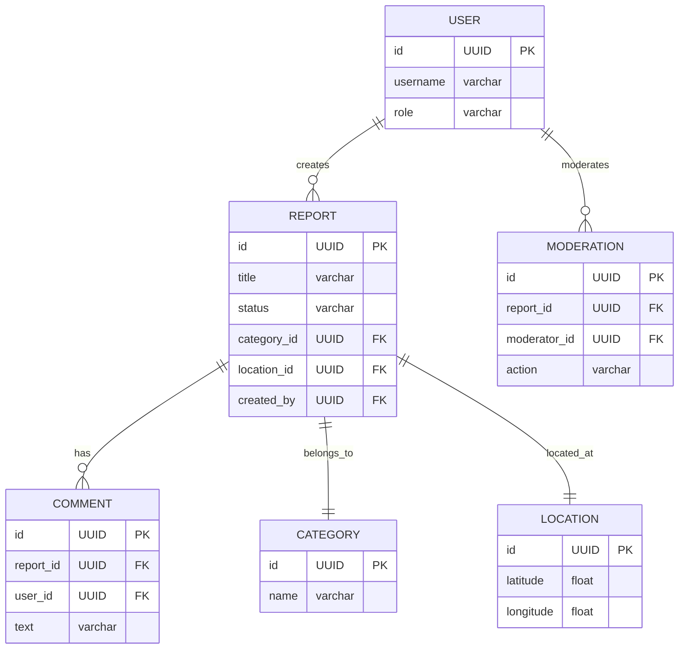

# Вариант 31 — Ключевые сущности, связи и API (эскиз)

## Сущности (основные)

### User

- **id**: UUID
- **username**: string (unique)
- **password_hash**: string
- **role**: enum [admin, user]

### Report

- **id**: UUID
- **title**: string
- **description**: string
- **category_id**: reference → Category.id
- **status**: enum [new, in_progress, resolved, rejected]
- **location_id**: reference → Location.id
- **created_by**: reference → User.id
- **created_at**: datetime

### Category

- **id**: UUID
- **name**: string
- **description**: string (opt)

### Comment

- **id**: UUID
- **report_id**: reference → Report.id
- **user_id**: reference → User.id
- **text**: string
- **created_at**: datetime

### Location

- **id**: UUID
- **latitude**: float
- **longitude**: float
- **address**: string (opt)

### Moderation

- **id**: UUID
- **report_id**: reference → Report.id
- **moderator_id**: reference → User.id
- **action**: enum [approve, reject]
- **comment**: string (opt)

## Связи (ER-эскиз)

- User 1..* Report
- Report 1..* Comment
- Report 1..1 Category
- Report 1..1 Location
- User 1..* Moderation

## Обязательные поля и ограничения

- unique(User.username)
- Report.category_id → Category.id (FK, not null)
- Report.location_id → Location.id (FK, not null)
- Comment.report_id → Report.id (FK, not null)
- Moderation.report_id → Report.id (FK, not null)

## API — верхнеуровневые ресурсы

### /users

- GET /users
- POST /users
- GET /users/{id}
- PUT /users/{id}
- DELETE /users/{id}

### /reports

- GET /reports?category=&status=&userId=&limit=&offset=
- POST /reports
- GET /reports/{id}
- PUT /reports/{id}
- DELETE /reports/{id}

### /categories

- GET /categories
- POST /categories
- GET /categories/{id}
- PUT /categories/{id}

### /comments

- POST /comments
- GET /comments?reportId=
- DELETE /comments/{id}

### /locations

- POST /locations
- GET /locations/{id}

### /moderation

- POST /moderation
- GET /moderation?reportId=

## Общие принципы API

- Формат ответа:  
`{ "status": "ok" | "error", "data"?: ..., "error"?: {code, message, fields?} }`
- Пагинация: limit и offset
- Аутентификация: Bearer JWT
- Роли: admin, user

### Пример ошибки

```json
{
  "status": "error",
  "error": {
    "code": "validation_failed",
    "message": "Validation failed",
    "fields": { "title": "required" }
  }
}
```

Auth

- POST /auth/register

- POST /auth/login

- POST /auth/refresh

Reports

- POST /reports
Payload: {title, description, categoryId, location:{lat,long,address?}}

- GET /reports

- GET /reports/{id}

- PUT /reports/{id}

- DELETE /reports/{id}

Comments

- POST /comments

- GET /comments?reportId=

- DELETE /comments/{id}

Moderation

- POST /moderation
Payload: {reportId, action, comment?}

- GET /moderation?reportId=

Dashboards (опционально)

- GET /dashboards/reports/stats?from=&to=

## ERD (диаграмма сущностей)

Mermaid-диаграмма (если рендер поддерживается:



ASCII-эскиз (если mermaid не рендерится):

```text
User 1 --- * Report 1 --- * Comment
        \
         \--- * Moderation
Report --- Category
Report --- Location

```

---

AC — критерии приёмки для функционала Alerts (MVP)

- AC1: POST /reports создаёт жалобу со статусом new
- AC2: GET /reports?userId= показывает только жалобы пользователя
- AC3: Комментарии создаются только при существующем report
- AC4: Модерация доступна только admin
- AC5: Изменение статуса отправляет Web Push
