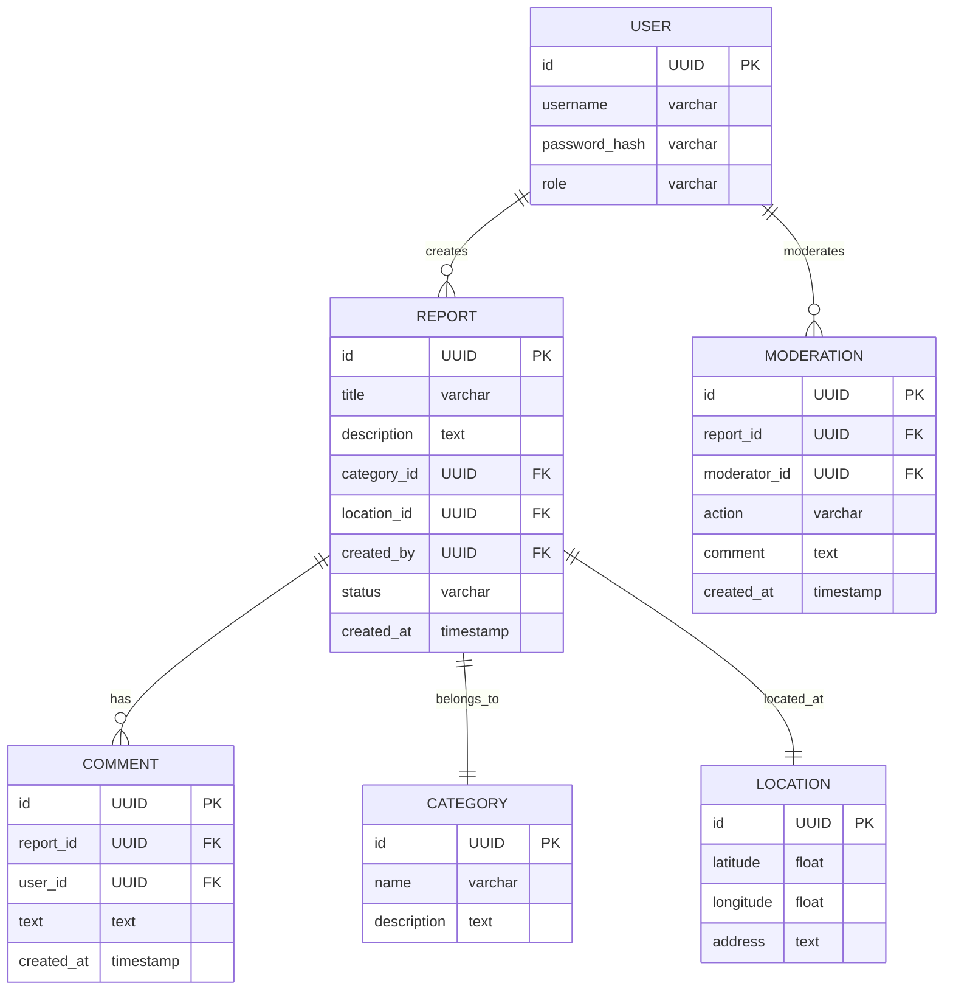

# Вариант 31 — ERD (диаграмма сущностей) — Городские жалобы «Чиним город»

Файл содержит: 1) mermaid-диаграмму ERD; 2) ASCII-эскиз; 3) минимальный SQL DDL-скетч для создания таблиц.

## Mermaid ERD



## ASCII-эскиз

```
User 1---* Report 1---* Comment
        \           \
         \           *---1 Category
          \---1 Location
           \
            *---* Moderation (User moderates Reports)

```

## Минимальный SQL DDL (пример, PostgreSQL)

```sql
CREATE TABLE users (
    id UUID PRIMARY KEY DEFAULT gen_random_uuid(),
    username TEXT UNIQUE NOT NULL,
    password_hash TEXT NOT NULL,
    role TEXT NOT NULL CHECK (role IN ('admin', 'user')),
    created_at TIMESTAMP WITH TIME ZONE DEFAULT now()
);

CREATE TABLE categories (
    id UUID PRIMARY KEY DEFAULT gen_random_uuid(),
    name TEXT NOT NULL,
    description TEXT,
    created_at TIMESTAMP WITH TIME ZONE DEFAULT now()
);

CREATE TABLE locations (
    id UUID PRIMARY KEY DEFAULT gen_random_uuid(),
    latitude DOUBLE PRECISION NOT NULL,
    longitude DOUBLE PRECISION NOT NULL,
    address TEXT,
    created_at TIMESTAMP WITH TIME ZONE DEFAULT now()
);

CREATE TABLE reports (
    id UUID PRIMARY KEY DEFAULT gen_random_uuid(),
    title TEXT NOT NULL,
    description TEXT NOT NULL,
    category_id UUID NOT NULL REFERENCES categories(id) ON DELETE CASCADE,
    location_id UUID NOT NULL REFERENCES locations(id) ON DELETE CASCADE,
    created_by UUID NOT NULL REFERENCES users(id) ON DELETE CASCADE,
    status TEXT NOT NULL CHECK (status IN ('new', 'in_progress', 'resolved', 'rejected')),
    created_at TIMESTAMP WITH TIME ZONE DEFAULT now(),
    updated_at TIMESTAMP WITH TIME ZONE DEFAULT now()
);

CREATE TABLE comments (
    id UUID PRIMARY KEY DEFAULT gen_random_uuid(),
    report_id UUID NOT NULL REFERENCES reports(id) ON DELETE CASCADE,
    user_id UUID NOT NULL REFERENCES users(id) ON DELETE CASCADE,
    text TEXT NOT NULL,
    created_at TIMESTAMP WITH TIME ZONE DEFAULT now()
);

CREATE TABLE moderation (
    id UUID PRIMARY KEY DEFAULT gen_random_uuid(),
    report_id UUID NOT NULL REFERENCES reports(id) ON DELETE CASCADE,
    moderator_id UUID NOT NULL REFERENCES users(id) ON DELETE CASCADE,
    action TEXT NOT NULL CHECK (action IN ('approve', 'reject')),
    comment TEXT,
    created_at TIMESTAMP WITH TIME ZONE DEFAULT now()
);
```
