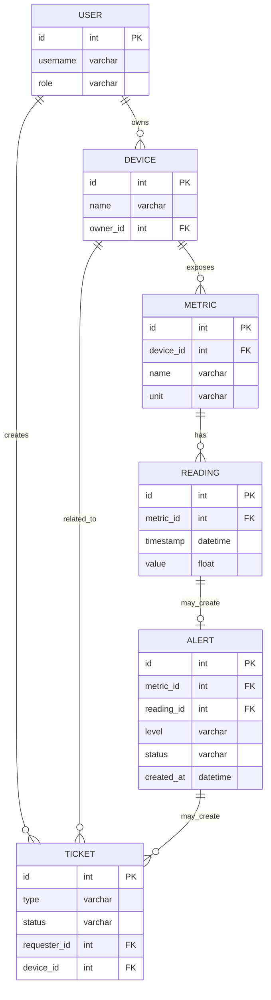

# Вариант 38 — Ключевые сущности, связи и API (эскиз)

Сущности (основные)

- User
  - id: UUID
  - username: string (unique)
  - password_hash: string
  - role: enum [admin, user]

- Device
  - id: UUID
  - name: string
  - description: string
  - owner_id: reference -> User.id

- Metric
  - id: UUID
  - device_id: reference -> Device.id
  - name: string
  - unit: string

- Reading
  - id: UUID
  - metric_id: reference -> Metric.id
  - timestamp: datetime
  - value: number

- Alert
  - id: UUID
  - metric_id: reference -> Metric.id
  - reading_id: reference -> Reading.id (opt)
  - level: enum [info, warning, critical]
  - message: string
  - status: enum [new, acknowledged, closed]
  - created_at: datetime

Связи (ER-эскиз)

- User 1..* Device (пользователь владеет устройствами)
- Device 1..* Metric (устройство имеет метрики)
- Metric 1..* Reading (метрика имеет показания)
- Reading 0..1 Alert (показание может породить алерт)

Обязательные поля и ограничения (кратко)

- unique(User.username)
- Device.owner_id → User.id (FK, not null)
- Metric.device_id → Device.id (FK, not null)
- Reading.metric_id → Metric.id (FK, not null)
- Alert.metric_id → Metric.id (FK, not null)

API — верхнеуровневые ресурсы и операции

- /users
  - GET /users (admin)
  - POST /users (admin)
  - GET /users/{id}
  - PUT /users/{id}
  - DELETE /users/{id}

- /devices
  - GET /devices (list, filter by owner)
  - POST /devices
  - GET /devices/{id}
  - PUT /devices/{id}
  - DELETE /devices/{id}

- /metrics
  - GET /metrics (filter by device)
  - POST /metrics
  - GET /metrics/{id}
  - PUT /metrics/{id}
  - DELETE /metrics/{id}

- /readings
  - POST /readings (ingest from device/service)
  - GET /readings?metric_id=&from=&to=&limit=&offset=
  - GET /readings/{id}

- /alerts
  - GET /alerts (filter by device/metric/status)
  - POST /alerts (create manual)
  - PUT /alerts/{id} (acknowledge/close)

Дополнительно (бонусы)

- WebSocket /ws/readings — поток показаний в реальном времени
- WebSocket /ws/alerts — нотификации алертов
- Документация API (OpenAPI/Swagger)
- Тесты: unit + интеграционные для engine алертов
---

## Подробные операции API, схемы и поведение

Общие принципы

- Ответы в формате: `{ "status": "ok" | "error", "data"?: ..., "error"?: {code, message, fields?} }`
- Пагинация: `limit` и `offset` (по умолчанию limit=50).
- Аутентификация: `Authorization: Bearer <jwt>`; роли: `admin`, `user`, `service`.

Примеры ошибок (JSON)

```json
{
  "status": "error",
  "error": { "code": "validation_failed", "message": "Validation failed", "fields": { "name": "required" } }
}
```

Auth

- POST `/auth/register` — `{email, password, name}` → `201 {id, email, name, role}`
- POST `/auth/login` — `{email, password}` → `200 {accessToken, refreshToken, user}`
- POST `/auth/refresh` — `{refreshToken}` → `200 {accessToken}`

Users

- GET `/users?limit=&offset=` — Admin
- GET `/users/{id}` — Admin или self
- POST `/users` — Admin (payload: `{username,email,password,role?}`)
- PUT `/users/{id}` — Admin или self (частичное обновление)
- DELETE `/users/{id}` — Admin

Devices

- GET `/devices?ownerId=&type=&status=&limit=&offset=` — список
- POST `/devices` — Admin (payload: `{name,description,location,ownerId,type?}`)
- GET `/devices/{id}` — детали, включает краткий список метрик
- PUT `/devices/{id}` — Admin или owner
- DELETE `/devices/{id}` — Admin

Metrics

- POST `/metrics` — Admin `{deviceId, name, unit, description?}` → `201 {id}`
- GET `/metrics?deviceId=` — список метрик для устройства
- GET `/metrics/{id}` — детали метрики
- PUT `/metrics/{id}` — Admin
- DELETE `/metrics/{id}` — Admin

Readings (ingest и чтение)

- POST `/readings` — массовая загрузка (ingest)

  - Payload (пример):

  ```json
  [
    {"deviceKey":"dev-key-1","metricName":"temperature","timestamp":"2025-10-13T10:00:00Z","value":23.4},
    {"deviceKey":"dev-key-1","metricName":"humidity","timestamp":"2025-10-13T10:00:00Z","value":55}
  ]
  ```

  - Response: `202 {accepted: n, rejected: m, errors: [...]}`
  - Права: устройства по `deviceKey` или сервисные токены.

- GET `/metrics/{id}/readings?from=&to=&agg=&step=&limit=&offset=`

  - Параметры: `agg` ∈ {raw,min,max,avg,sum}, `step` — агрегирующий интервал (например `1h`).

Alerts и правила (AlertRules)

- AlertRule: `{id, metricId, operator: '>'|'<'|'>='|'<=', threshold, level: 'info'|'warning'|'critical', enabled, createdBy}`

- POST `/alerts/rules` — Admin (создать правило)
- GET `/alerts/rules?metricId=` — список правил
- Engine: при поступлении Reading выполняется поиск правил для metricId; при совпадении создаётся Alert.

- Alert модель: `{id, metricId, readingId?, level, threshold?, message, status: 'new'|'acknowledged'|'closed', createdAt, createdBy}`

- GET `/alerts?deviceId=&metricId=&status=&level=&limit=&offset=` — список алертов
- POST `/alerts` — ручное создание (Admin)
- POST `/alerts/{id}/ack` — пометить как acknowledged
- POST `/alerts/{id}/mark-false` — пометить как ложный/закрыть с причиной

Tickets (заявки)

- POST `/tickets` — создать заявку (например, `request_device` или `request_home`)

  - Payload для `request_device`:

  ```json
  {"type":"request_device","requesterId":"user-1","deviceInfo": {"name":"Уличный датчик","description":"..."}}
  ```

- GET `/tickets?type=&status=&requesterId=&homeId=&deviceId=&limit=&offset=`
- GET `/tickets/{id}` — карточка тикета
- PUT `/tickets/{id}` — редактирование (Admin или requester)

Dashboards / Aggregates

- GET `/dashboards/home/{homeId}/metrics-summary?from=&to=` — возвращает для каждой метрики: `last, avg, max, alertsCount`.

Администрирование и логирование

- GET `/system/logs?level=&from=&to=&limit=&offset=` — Admin

WebSocket (опционально)

- `ws://host/live?token=...` — события: `reading`, `alert`, `ticketUpdate`.

---

## ERD (диаграмма сущностей)

Mermaid-диаграмма (если рендер поддерживается):



ASCII-эскиз (если mermaid не рендерится):

```text
User 1---* Device 1---* Metric 1---* Reading 0---1 Alert
      \                             
       \-*- Ticket (created by User, may reference Device/Alert)
```

---

AC — критерии приёмки для функционала Alerts (MVP)

- AC1: При ingest Reading, если правило превышено, создаётся запись в `/alerts` со статусом `new` и привязкой к `readingId`.
- AC2: GET `/alerts?deviceId=` возвращает алерты только для устройств, которыми владеет запрашивающий пользователь (scope).
- AC3: POST `/alerts/{id}/ack` переводит состояние в `acknowledged` и добавляет запись в audit log (кто и когда).
