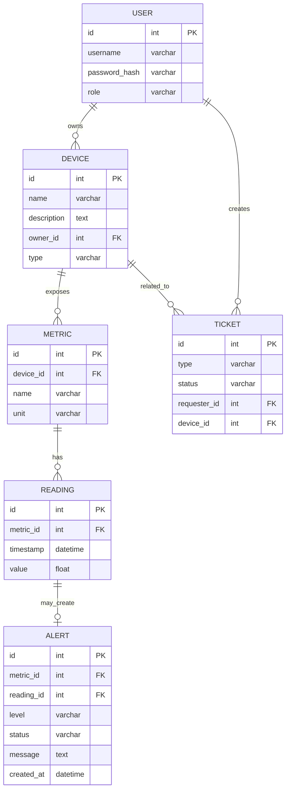

# Вариант 38 — ERD (диаграмма сущностей) — Датчики «Умный дом lite»

Файл содержит: 1) mermaid-диаграмму ERD; 2) ASCII-эскиз; 3) минимальный SQL DDL-скетч для создания таблиц.

## Mermaid ERD



## ASCII-эскиз

```
User 1---* Device 1---* Metric 1---* Reading 0---1 Alert
      \                              
       \-*- Ticket (created by User, may reference Device/Alert)
```

## Минимальный SQL DDL (пример, PostgreSQL)

```sql
CREATE TABLE users (
  id UUID PRIMARY KEY,
  username TEXT UNIQUE NOT NULL,
  password_hash TEXT NOT NULL,
  role TEXT NOT NULL CHECK (role IN ('admin','user'))
);

CREATE TABLE devices (
  id UUID PRIMARY KEY,
  name TEXT NOT NULL,
  description TEXT,
  owner_id UUID NOT NULL REFERENCES users(id) ON DELETE CASCADE,
  type TEXT
);

CREATE TABLE metrics (
  id UUID PRIMARY KEY,
  device_id UUID NOT NULL REFERENCES devices(id) ON DELETE CASCADE,
  name TEXT NOT NULL,
  unit TEXT NOT NULL
);

CREATE TABLE readings (
  id UUID PRIMARY KEY,
  metric_id UUID NOT NULL REFERENCES metrics(id) ON DELETE CASCADE,
  timestamp TIMESTAMP WITH TIME ZONE NOT NULL,
  value DOUBLE PRECISION NOT NULL
);

CREATE TABLE alerts (
  id UUID PRIMARY KEY,
  metric_id UUID NOT NULL REFERENCES metrics(id),
  reading_id UUID REFERENCES readings(id),
  level TEXT NOT NULL,
  status TEXT NOT NULL,
  message TEXT,
  created_at TIMESTAMP WITH TIME ZONE DEFAULT now()
);

CREATE TABLE tickets (
  id UUID PRIMARY KEY,
  type TEXT NOT NULL,
  status TEXT NOT NULL,
  requester_id UUID NOT NULL REFERENCES users(id),
  device_id UUID REFERENCES devices(id),
  payload JSONB
);
```
