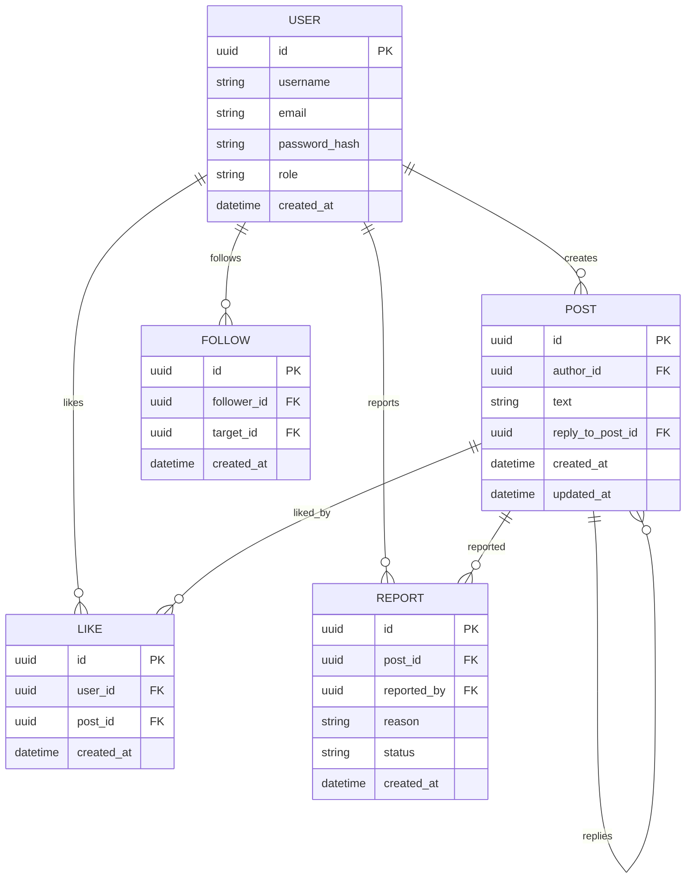

# Вариант 20 — Микро-твиттер «Мысли вслух» — Ключевые сущности, связи и API (MVP)

## Сущности (карточки) — поля и валидации

- User
  - id: UUID — автогенерация
  - username: string — уникальное, 3–32 символа, латиница/цифры/подчёркивание (^[A-Za-z0-9_]{3,32}$), обязательное → ошибка: «Введите корректное имя пользователя (латиница, цифры, подчёркивание).»
  - email: string — уникальное, email-формат, обязательное → ошибка: «Введите корректный email.»
  - password_hash: string — server-only
  - role: enum('user','admin') — default: user → ошибка: «Укажите корректную роль.»

Примечание: при регистрации клиент передаёт password, сервер валидирует длину ≥6 и хеширует.
→ ошибка при пароле: «Введите пароль (не менее 6 символов).»

- Post
  - id: UUID
  - author_id: UUID — FK → User.id, not null → ошибка: «Укажите автора поста.»
  - text: string — не пустое, max 280 символов → ошибка: «Текст поста не может быть пустым.» → ошибка: «Максимальная длина поста — 280 символов.»
  - reply_to_post_id: UUID | null — если это ответ (FK → Post.id)
  - created_at: datetime
  - updated_at: datetime | null

Поведение: ответы хранятся в той же таблице: reply — Post с полем reply_to_post_id.

- Follow
  - id: UUID
  - follower_id: UUID — FK → User.id, not null → ошибка: «Укажите пользователя, который подписывается.»
  - target_id: UUID — FK → User.id, not null → ошибка: «Укажите пользователя, на которого выполняется подписка.»
  - created_at: datetime
  - Уникальность: (follower_id, target_id) — нельзя подписаться дважды → ошибка: «Вы уже подписаны на этого пользователя.»
  - Правило: follower_id != target_id — нельзя подписаться на себя. → ошибка: «Нельзя подписаться на себя.»

- Like
  - id: UUID
  - user_id: UUID — FK → User.id, not null → ошибка: «Укажите пользователя.»
  - post_id: UUID — FK → Post.id, not null → ошибка: «Укажите пост.»
  - created_at: datetime
  - Уникальность: (user_id, post_id) — нельзя лайкнуть дважды → ошибка: «Вы уже лайкнули этот пост.»

- Reply
  - Ответы реализуются через Post.reply_to_post_id

- Report
  - id: UUID
  - post_id: UUID — FK → Post.id, not null → ошибка: «Укажите пост, на который подаётся жалоба.»
  - reported_by: UUID — FK → User.id, not null → ошибка: «Укажите пользователя, который подаёт жалобу.»
  - reason: string — не пустое, max 500 → ошибка: «Опишите причину жалобы.»
  - status: enum('open','reviewed') — default open → ошибка: «Укажите корректный статус.»
  - created_at: datetime

- ModeratorAction (опционально)
  - id: UUID
  - admin_id: UUID — FK → User.id, not null → ошибка: «Укажите администратора.»
  - action_type: enum('deletepost','blockuser') — not null → ошибка: «Укажите тип действия.»
  - target_object: enum('post','user') — not null → ошибка: «Укажите объект модерации.»
  - target_id: UUID — id поста или пользователя
  - comment: string — max 2000
  - created_at: datetime

## 3. Связи и ограничительные правила (ER-эскиз)

### ER-связи между сущностями

- User **1..*** Post  
  Пользователь создаёт посты.

- Post **1..*** Reply  
  Ответы являются постами, связанными по reply_to_post_id.

- User **1..*** Follow (как follower)  
  Пользователь подписывается на других.

- User **1..*** Follow (как target)  
  На пользователя могут подписываться.

- Post **1..*** Like  
  Пост может быть залайкан многими пользователями.

- User **1..*** Like  
  Пользователь может лайкать разные посты.

- Post **1..*** Report  
  На пост может быть отправлено несколько жалоб.

- User **1..*** Report (как автор жалобы)  
  Пользователь подаёт жалобы.

- ModeratorAction связана:
  - с User (admin_id) — администратор
  - с целевым объектом (target_id) — Post или User

### Ограничения базы данных (constraints)

- Обязательные внешние ключи (FK) на все связи.
- `ON DELETE CASCADE` для зависимых сущностей:
  - при удалении поста удаляются → likes, replies, reports
  - при удалении пользователя удаляются → его posts/likes/reports/follows  
    *(или помечаются, если в системе предусмотрено)*

### Индексы

- `posts(author_id, created_at)` — для вывода списка постов автора.
- `posts(created_at)` — для глобальной сортировки ленты.
- `follows(follower_id, target_id)` — `unique`, исключает повторную подписку.
- `likes(user_id, post_id)` — `unique`, исключает повторный лайк.
- `reports(status, created_at)` — для админ-панели и фильтрации жалоб.

## 4. Ресурсы API (эндпоинты)

### 4.1 Auth

- **POST /auth/register**  
  Создание пользователя.  
  Тело: `{ username, email, password }`

- **POST /auth/login**  
  Возвращает токен.  
  Тело: `{ username, password }`

### 4.2 Users

- **GET /users/:username**  
  Получить профиль пользователя: посты, подписчики, подписки.

- **GET /users/:username/posts**  
  Посты пользователя.

- **GET /users/:username/followers**  
  Список подписчиков.

- **GET /users/:username/following**  
  Кого пользователь читает.

- **PATCH /users/me**  
  Изменение username/email.  
  Только владелец.

- **GET /users** (admin)  
  Список всех пользователей.

### 4.3 Posts

- **GET /posts/:id**  
  Получить один пост.

- **POST /posts**  
  Создать пост.  
  Тело: `{ text }`

- **PATCH /posts/:id**  
  Редактирование поста (только автор).

- **DELETE /posts/:id**  
  Удалить пост (автор или админ).

- **GET /feed**  
  Лента постов от тех, на кого подписан пользователь.  
  Пагинация: `?limit=&offset=`

### 4.4 Follows

- **POST /follows/:username**  
  Подписаться на пользователя.

- **DELETE /follows/:username**  
  Отписаться.

- **GET /follows/me**  
  Мои подписки и подписчики.

### 4.5 Likes

- **POST /posts/:id/like**  
  Лайк поста.

- **DELETE /posts/:id/like**  
  Удалить лайк.

- **GET /posts/:id/likes**  
  Список лайкнувших.

### 4.6 Replies

- **GET /posts/:id/replies**  
  Получить ответы.

- **POST /posts/:id/replies**  
  Создать ответ.  
  Тело: `{ text }`

- **DELETE /replies/:id**  
  Удалить свой ответ или админ.

### 4.7 Reports (жалобы)

- **POST /posts/:id/report**  
  Создать жалобу.  
  Тело: `{ reason }`

- **GET /reports** (admin)  
  Все жалобы. Фильтры: `?status=open`

- **GET /reports/:id** (admin)  
  Просмотр жалобы.

- **PATCH /reports/:id** (admin)  
  Изменить статус `open → reviewed`.

### 4.8 Moderator Actions (опционально)

- **POST /admin/moderation**  
  Создать запись о модераторском действии.  
  Тело: `{ action_type, target_object, target_id, comment }`

- **GET /admin/moderation**  
  Список действий модераторов.

- **GET /admin/moderation/:id**  
  Детали действия.

### 4.9 Admin (общие)

- **GET /admin/posts**  
  Все посты.

- **DELETE /admin/posts/:id**  
  Удалить любой пост.

- **GET /admin/logs** (опционально)  
  Логи действий.

## 5. Формат ошибок и валидации

Все ошибки возвращаются в едином формате:

```json
{
  "status": "error",
  "error": {
    "code": "<error_code>",
    "message": "<описание ошибки>",
    "fields": { ... } // опционально
  }
}
```

### 5.1 Ошибки валидации полей

Возникают, если одно или несколько полей не проходят проверку.

```json
{
  "status": "error",
  "error": {
    "code": "validation_failed",
    "message": "Validation failed",
    "fields": {
      "text": "Текст поста не может быть пустым.",
      "username": "Введите корректное имя пользователя."
    }
  }
}
```

### 5.2 Доступ запрещён

Возвращается, если действие недоступно для роли пользователя или объект ему не принадлежит.

```json
{
  "status": "error",
  "error": {
    "code": "forbidden",
    "message": "Доступ запрещён"
  }
}
```

### 5.3 Ресурс не найден

Используется, если указанного ресурса (поста, пользователя, репорта) не существует.

```json
{
  "status": "error",
  "error": {
    "code": "not_found",
    "message": "Пост не найден"
  }
}
```

### 5.4 Конфликт (duplicate)

Возникает при попытке создать сущность, нарушающую уникальное ограничение
(например, повторная подписка или лайк).

```json
{
  "status": "error",
  "error": {
    "code": "conflict",
    "message": "Вы уже подписаны на этого пользователя."
  }
}
```

## 6. Авторизация и права доступа

### Гость

- доступ: `/login`, `/register`, просмотр публичных постов и профилей
- нет доступа к: созданию постов, лайкам, подпискам, ответам, жалобам, личной ленте

### Пользователь

- может: создавать/редактировать/удалять **свои** посты; лайкать; подписываться/отписываться; отвечать; подавать жалобы; смотреть `/feed`; редактировать профиль
- не может: изменять чужие посты; управлять пользователями; работать с модерацией

### Администратор

- полный доступ: управление пользователями; удаление любых постов; просмотр и обработка жалоб; просмотр журнала модерации

### Scope фильтрации

- при запросах списков данные должны возвращаться только в рамках доступов ролей  
  (пользователь — только свои данные; администратор — всё; гость — только публичное)

## 7. Pagination, фильтры, сортировка

Все списки поддерживают параметры `limit` и `offset`.  
Ответ должен включать метаданные пагинации:

```json
{
  "status": "ok",
  "data": [ ... ],
  "meta": {
    "limit": 20,
    "offset": 0,
    "total": 123
  }
}
```

### Фильтры по ресурсам

- Посты

```bash
/posts?authorId=&since=&until=&limit=&offset=
```

- Лента (подписки)

```bash
/feed?limit=&offset=&since=
```

- Админка: жалобы

```bash
/admin/reports?status=&limit=&offset=
```

### Сортировка

- Сортировка по умолчанию: created_at DESC (новые → старые).
- Параметр sort отсутствует в рамках MVP.
- Все списки (posts, feed, reports) возвращаются в порядке «самые свежие сверху».

Примеры:

```pgsql
/posts → сортировка по created_at DESC
/feed → сортировка по created_at DESC
/admin/reports → сортировка по created_at DESC
```

## 8. Acceptance criteria (MVP)

### Общее

- репозиторий с базой кода
- README с инструкциями запуска (локально и через `docker-compose`)
- аутентификация/авторизация через JWT
- роли: `user`, `admin`

### Функционал (MVP)

**AC1:** Регистрация и логин пользователя; выдача JWT.  
**AC2:** CRUD для постов:
- создание
- чтение
- редактирование — только автор или admin
- удаление — только автор или admin
**AC3:** Лента `/feed` отображает посты пользователей, на которых подписан текущий пользователь (с пагинацией).

**AC4:** Подписки:
- `POST /follow/{targetUserId}`
- `DELETE /follow/{targetUserId}`
- уникальность подписки
- нельзя подписаться на себя

**AC5:** Лайки:
- `POST /posts/{id}/like`
- `DELETE /posts/{id}/like`
- уникальность лайка

**AC6:** Ответы:
- ответы — это Post с `reply_to_post_id`
- `GET /posts/{id}/replies` возвращает ответы

**AC7:** Жалобы:
- `POST /posts/{id}/report` создаёт запись в `reports` со статусом `open`

**AC8:** Админ:
- `GET /admin/reports` возвращает жалобы
- админ может пометить жалобу как `reviewed`
- админ может удалить пост при необходимости

**AC9:** Валидации на сервере и клиенте (соответствуют текстам ошибок в карточках).

**AC10:** База данных:
- миграции
- сиды (несколько тестовых пользователей и постов для демо)

## 9. Mermaid ERD


