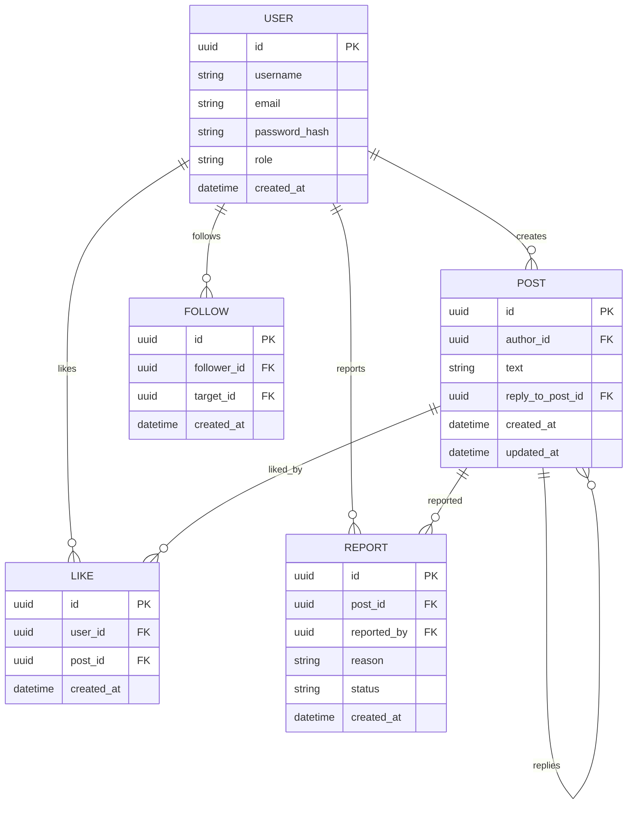

# Вариант 38 — ERD (диаграмма сущностей) — Датчики «Умный дом lite»

Файл содержит: 1) mermaid-диаграмму ERD; 2) ASCII-эскиз; 3) минимальный SQL DDL-скетч для создания таблиц.

## Mermaid ERD



## ASCII-эскиз

```
User 1 --- * Post
User 1 --- * Follow (follows other users)
User 1 --- * Like
User 1 --- * Report

Post 1 --- * Reply (post → post)
Post 1 --- * Like
Post 1 --- * Report

Follow:
  follower → target

Reply:
  reply_post → parent_post
```

## Минимальный SQL DDL (пример, PostgreSQL)

```sql
CREATE TABLE users (
    id UUID PRIMARY KEY,
    username TEXT UNIQUE NOT NULL,
    email TEXT UNIQUE NOT NULL,
    password_hash TEXT NOT NULL,
    role TEXT NOT NULL DEFAULT 'user',
    created_at TIMESTAMP WITH TIME ZONE DEFAULT now()
);

CREATE TABLE posts (
    id UUID PRIMARY KEY,
    author_id UUID NOT NULL REFERENCES users(id) ON DELETE CASCADE,
    text TEXT NOT NULL CHECK (length(text) <= 280),
    reply_to_post_id UUID REFERENCES posts(id) ON DELETE SET NULL,
    created_at TIMESTAMP WITH TIME ZONE DEFAULT now(),
    updated_at TIMESTAMP WITH TIME ZONE DEFAULT now()
);

CREATE TABLE follows (
    id UUID PRIMARY KEY,
    follower_id UUID NOT NULL REFERENCES users(id) ON DELETE CASCADE,
    target_id UUID NOT NULL REFERENCES users(id) ON DELETE CASCADE,
    created_at TIMESTAMP WITH TIME ZONE DEFAULT now(),
    UNIQUE (follower_id, target_id)
);

CREATE TABLE likes (
    id UUID PRIMARY KEY,
    user_id UUID NOT NULL REFERENCES users(id) ON DELETE CASCADE,
    post_id UUID NOT NULL REFERENCES posts(id) ON DELETE CASCADE,
    created_at TIMESTAMP WITH TIME ZONE DEFAULT now(),
    UNIQUE (user_id, post_id)
);

CREATE TABLE reports (
    id UUID PRIMARY KEY,
    post_id UUID NOT NULL REFERENCES posts(id) ON DELETE CASCADE,
    reported_by UUID NOT NULL REFERENCES users(id) ON DELETE CASCADE,
    reason TEXT NOT NULL,
    status TEXT NOT NULL DEFAULT 'pending',
    created_at TIMESTAMP WITH TIME ZONE DEFAULT now()
);
```
