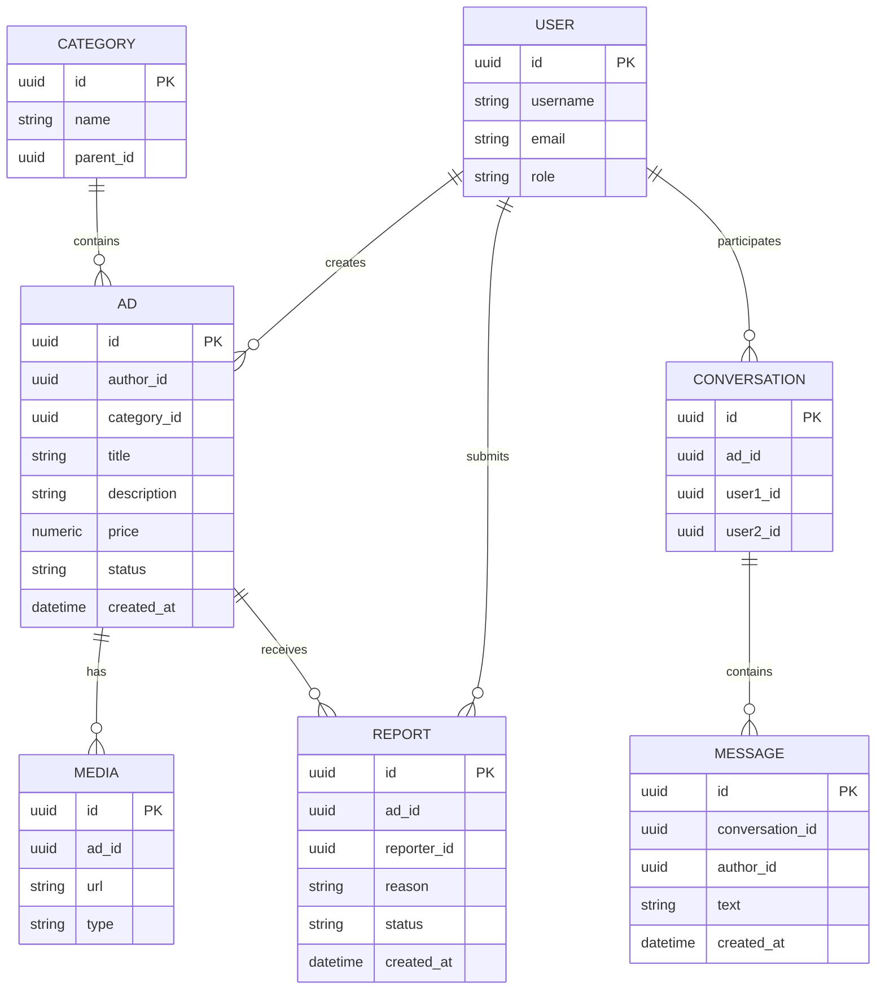

# Вариант 8 — Ключевые сущности, связи и API (эскиз)

Сущности (основные)

- User
  - id: UUID
  - username: string (unique)
  - email: string (unique)
  - password_hash: string
  - role: enum [admin, moderator, user]

- Category
  - id: UUID
  - name: string
  - parent_id: reference → Category.id (опционально)

- Ad (объявление)
  - id: UUID
  - author_id: reference → User.id
  - category_id: reference → Category.id
  - title: string
  - description: string
  - price: number
  - location: string
  - status: enum [active, paused, archived, banned]
  - created_at: datetime

- Media
  - id: UUID
  - ad_id: reference → Ad.id
  - url: string
  - type: enum [image, video]

- Conversation
  - id: UUID
  - ad_id: reference → Ad.id
  - user1_id: reference → User.id
  - user2_id: reference → User.id

- Message
  - id: UUID
  - conversation_id: reference → Conversation.id
  - author_id: reference → User.id
  - text: string
  - created_at: datetime

- Report (жалоба)
  - id: UUID
  - ad_id: reference → Ad.id
  - reporter_id: reference → User.id
  - reason: string
  - status: enum [new, reviewing, resolved]
  - created_at: datetime

Связи (ER-эскиз)

- User 1..* Ad (пользователь публикует объявления)
- Category 1..* Ad (категория содержит объявления)
- Ad 1..* Media (объявление содержит изображения/видео)
- Ad 1..* Report (объявление получает жалобы)
- User 1..* Report (пользователь отправляет жалобы)
- Conversation 1..* Message (чат содержит сообщения)
- User участвует в Conversation как одна из сторон (user1/user2)

Обязательные поля и ограничения (кратко)

- unique(User.username), unique(User.email)
- Ad.author_id → User.id (FK, not null)
- Ad.category_id → Category.id (FK, not null)
- Media.ad_id → Ad.id (FK, not null)
- Conversation.user1_id ≠ Conversation.user2_id
- Message.text — not null
- Report.status ∈ {new, reviewing, resolved}

API — верхнеуровневые ресурсы и операции

- /users
  - GET `/users` (admin)
  - POST `/users` (admin)
  - GET `/users/{id}` (admin или self)
  - PUT `/users/{id}` (admin или self)
  - DELETE `/users/{id}` (admin)

- /categories
  - GET `/categories`
  - POST `/categories` (admin)
  - GET `/categories/{id}`
  - PUT `/categories/{id}` (admin)
  - DELETE `/categories/{id}` (admin)

- /ads:
  - GET `/ads`
  - POST `/ads`
  - GET `/ads/{id}`
  - PUT `/ads/{id}`
  - DELETE `/ads/{id}`
  - POST `/ads/{id}/media`
  - GET `/ads/{id}/media`

- /media:
  - DELETE `/media/{id}`

- /conversations:
  - GET `/conversations`
  - POST `/conversations`
  - GET `/conversations/{id}`
  - GET `/conversations/{id}/messages`
  - POST `/conversations/{id}/messages`

- /reports:
  - POST `/reports`
  - GET `/reports`
  - GET `/reports/{id}`
  - PUT `/reports/{id}`

Дополнительно (бонусы)

- WebSocket /ws/messages — обновления чатов в реальном времени
- WebSocket /ws/notifications — уведомления о статусе жалоб и объявления
- Документация API (OpenAPI/Swagger)
- Тесты: unit + интеграционные
- Платёжный модуль (заглушка)

---

## Подробные операции API, схемы и поведение

Общие принципы

- Ответы в формате: `{ "status": "ok" | "error", "data"?: ..., "error"?: {code, message, fields?} }`
- Пагинация: `limit` и `offset` (по умолчанию limit=50).
- Аутентификация: `Authorization: Bearer <jwt>`; роли: `admin`, `moderatoк`, `user`.

Примеры ошибок (JSON)

```json
{
  "status": "error",
  "error": { "code": "validation_failed", "message": "Validation failed", "fields": { "name": "required" } }
}
```

Auth

- POST `/auth/register` — `{email, password, name}` → `201 {id, email, name, role}`
- POST `/auth/login` — `{email, password}` → `200 {accessToken, refreshToken, user}`
- POST `/auth/refresh` — `{refreshToken}` → `200 {accessToken}`

Users

- GET `/users?limit=&offset=` — Admin
- GET `/users/{id}` — Admin или self
- POST `/users — Admin (payload: {username,email,password,role?}`)
- PUT `/users/{id}` — Admin или self (частичное обновление)
- DELETE `/users/{id}` — Admin

Categories

- GET `/categories` — список категорий
- POST `/categories` — Admin (payload: {name,parentId?})
- GET `/categories/{id}` — получение категории
- PUT `/categories/{id}` — Admin
- DELETE `/categories/{id}` — Admin

Ads

- GET `/ads?categoryId=&query=&price_from=&price_to=&limit=&offset=` — список объявлений с фильтрами
- POST `/ads` — создание объявления (payload: {title,description,price,categoryId,location?})
- GET `/ads/{id}` — детали объявления
- PUT `/ads/{id}` — Admin, Moderator или Author
- DELETE `/ads/{id}`— Admin, Moderator или Author
- POST `/ads/{id}/media` — загрузка медиа (изображения/видео)
- GET `/ads/{id}/media` — список медиа для объявления

Media

- DELETE `/media/{id}` — Author, Moderator или Admin

Conversations

- GET `/conversations?limit=&offset=` — список чатов пользователя
- POST `/conversations` — создать чат по объявлению (payload: {adId,partnerId})
- GET `/conversations/{id}` — получить чат
- GET `/conversations/{id}/messages?limit=&offset=` — список сообщений
- POST `/conversations/{id}/messages` — отправка сообщения (payload: {text})

Reports (жалобы)

- POST `/reports` — подать жалобу (payload: {adId,reason})
- GET `/reports?status=&limit=&offset=` — Moderator/Admin — список жалоб
- GET `/reports/{id}` — Moderator/Admin — карточка жалобы
- PUT `/reports/{id}` — Moderator/Admin — смена статуса (payload: {status})

Дополнительно (бонусы)

Платежи (заглушка)

- POST `/payments/create` — создать платёж (имитация)
- GET `/payments/{id}` — статус платежа

Загрузка файлов

- POST `/uploads` — загрузка файла (универсальная)

Документация и тесты

- OpenAPI/Swagger: /docs
- Юнит-тесты для основных сервисов

Администрирование и логирование

- GET `/system/logs?level=&from=&to=&limit=&offset=` — Admin (возвращает события: входы, жалобы, модерация, изменения объявлений)

WebSocket (опционально)

- ws://host/live?token=... — события:
  - message — новое сообщение в чате
  - reportUpdate — обновление статуса жалобы
  - adStatus — изменение статуса объявления

---

## ERD (диаграмма сущностей)

Mermaid-диаграмма (если рендер поддерживается):



ASCII-эскиз (если mermaid не рендерится):

```text
User 1---* Ad 1---* Media
            \
             \---* Report

User 1---* Conversation *---1 User
Conversation 1---* Message

Category 1---* Ad
```

---

AC — критерии приёмки для функционала Alerts (MVP)

- AC1: Пользователь может создать объявление, указав обязательные поля.
- AC2: Пользователь может загрузить изображения к своему объявлению.
- AC3: Пользователь может открыть объявление и написать продавцу (создаётся чат).
- AC4: Пользователь может подать жалобу на объявление.
- AC5: Модератор может сменить статус жалобы и заблокировать объявление.
- AC6: Обычный пользователь не может редактировать или удалять чужие объявления.
