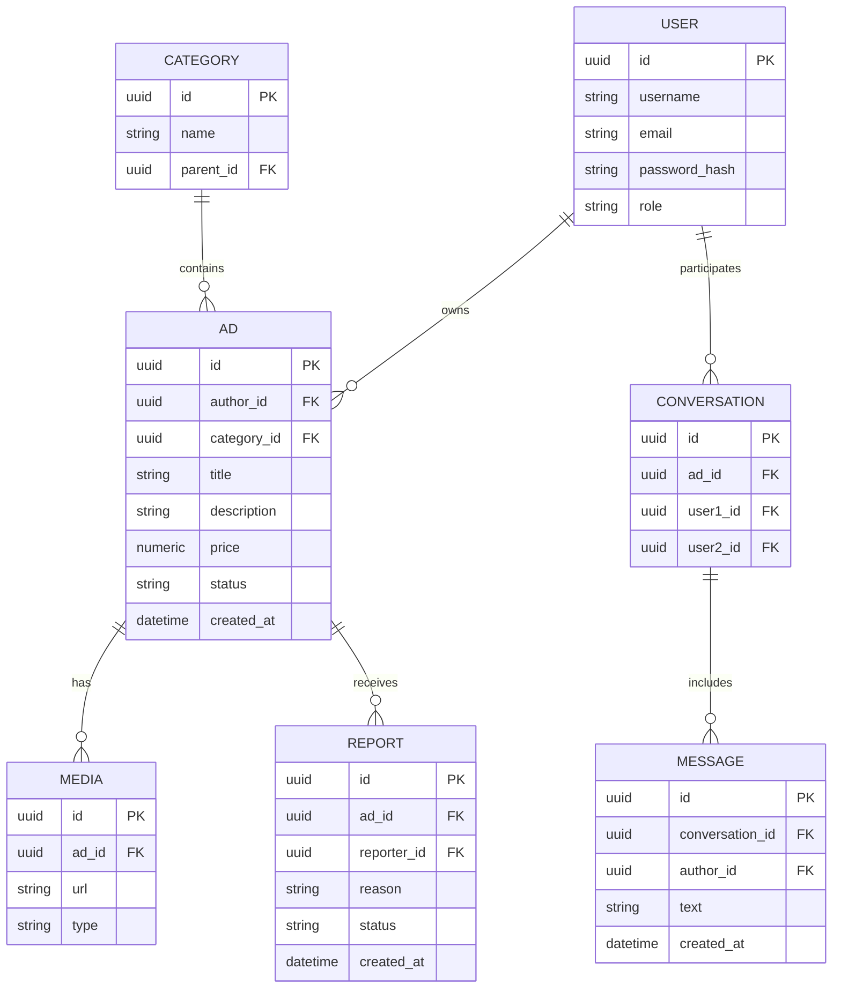

# Вариант 8 — ERD (диаграмма сущностей) — Объявки «Бери, пока горячее»

Файл содержит: 1) mermaid-диаграмму ERD; 2) ASCII-эскиз; 3) минимальный SQL DDL-скетч для создания таблиц.

## Mermaid ERD



## ASCII-эскиз

```
User 1---* Ad 1---* Media
             \
              \---* Report

Ad 1---* Conversation *---1 User
Conversation 1---* Message

Category 1---* Ad
```

## Минимальный SQL DDL (пример, PostgreSQL)

```sql
CREATE TABLE users (
    id UUID PRIMARY KEY,
    username TEXT NOT NULL UNIQUE,
    email TEXT NOT NULL UNIQUE,
    password_hash TEXT NOT NULL,
    role TEXT CHECK(role IN ('user','moderator','admin'))
);

CREATE TABLE categories (
    id UUID PRIMARY KEY,
    name TEXT NOT NULL,
    parent_id UUID REFERENCES categories(id)
);

CREATE TABLE ads (
    id UUID PRIMARY KEY,
    author_id UUID REFERENCES users(id),
    category_id UUID REFERENCES categories(id),
    title TEXT NOT NULL,
    description TEXT,
    price NUMERIC CHECK(price >= 0),
    status TEXT NOT NULL,
    created_at TIMESTAMP DEFAULT now()
);

CREATE TABLE media (
    id UUID PRIMARY KEY,
    ad_id UUID REFERENCES ads(id) ON DELETE CASCADE,
    url TEXT NOT NULL,
    type TEXT CHECK(type IN ('image','video'))
);

CREATE TABLE conversations (
    id UUID PRIMARY KEY,
    ad_id UUID REFERENCES ads(id),
    user1_id UUID REFERENCES users(id),
    user2_id UUID REFERENCES users(id)
);

CREATE TABLE messages (
    id UUID PRIMARY KEY,
    conversation_id UUID REFERENCES conversations(id) ON DELETE CASCADE,
    author_id UUID REFERENCES users(id),
    text TEXT NOT NULL,
    created_at TIMESTAMP DEFAULT now()
);

CREATE TABLE reports (
    id UUID PRIMARY KEY,
    ad_id UUID REFERENCES ads(id),
    reporter_id UUID REFERENCES users(id),
    reason TEXT NOT NULL,
    status TEXT,
    created_at TIMESTAMP DEFAULT now()
);
```
